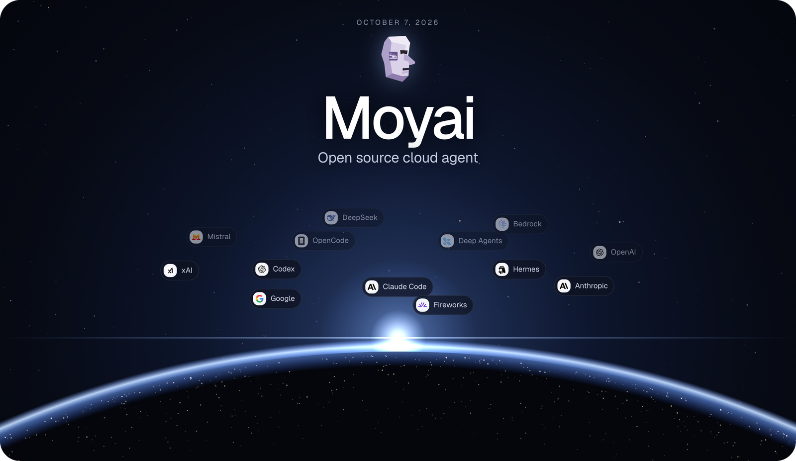
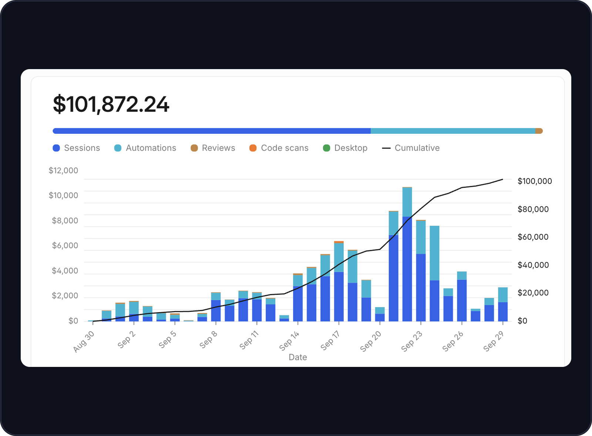
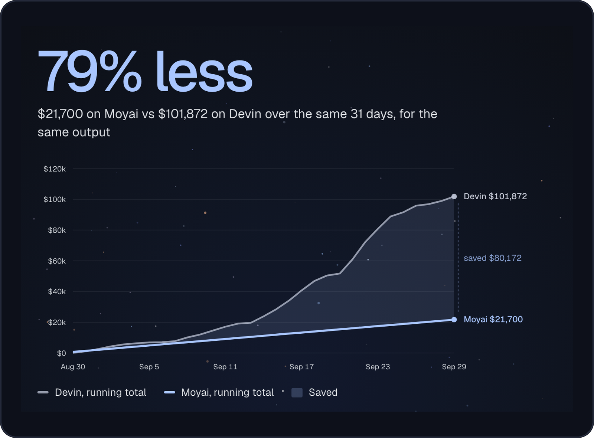

# Moyai

<p align="center">
  
</p>

A self-hosted coding agent for background work. Give it a task from your browser or Slack; it edits code, runs tests, and opens a pull request for review. Send corrections while it works or resume with saved files and conversation history.

## Harnesses

<p align="center">
  
</p>

New sessions default to the native **Claude Agent SDK** with prompt caching enabled. You can pick a different harness for each session: **Hermes, Claude Agent SDK, Codex, OpenCode, Deep Agents, or Tool Loop**. Every harness runs in the same isolated workspace with the same tools and permissions. See [supported combinations and custom harnesses](docs/harnesses.md).

## Models and providers

<p align="center">
  
</p>

Moyai uses [LiteLLM](https://github.com/BerriAI/litellm) for inference, so it can run on any of the 100+ providers LiteLLM supports. Point it at your [LiteLLM gateway](https://docs.litellm.ai/), switch models between messages, and spend is tracked per teammate. Provider keys stay on the server, and the sandbox never sees them.

## Moyai vs Devin price

We moved our internal coding agent from Devin to Moyai. For the same work over the same 31 days, Moyai cost about $21,700 and Devin cost $101,872, which is 79% less

**Devin: $101,872 in 31 days**

<p align="center">
  
</p>

**Moyai: about $21,700 in 31 days, or $700 a day**

<p align="center">
  
</p>

Read the full story in the launch post: [Open Sourcing Moyai](https://docs.litellm.ai/blog/moyai-open-source)

## Getting started

This setup runs Moyai on **Modal**, using **GPT-6 Astra + the Claude Agent SDK harness** through LiteLLM. You can [choose another model or harness](docs/getting-started.md#choose-a-harness).

You'll need Git, Python 3.12+, [uv](https://docs.astral.sh/uv/getting-started/installation/), a [Modal account](https://modal.com/docs/guide), and a [LiteLLM gateway](docs/getting-started.md#3-configure-a-model-endpoint) with GPT-6 Astra enabled. Commands use a macOS/Linux shell; Windows users can use WSL.

### 1. Install

```sh
git clone https://github.com/BerriAI/moyai.git
cd moyai
uv sync --frozen
cp .env.example .env
chmod 600 .env
```

### 2. Add your credentials

Log in to Modal:

```sh
uv run modal token new
```

Open `~/.modal.toml` in a private editor window. Copy your workspace's `token_id` and `token_secret` into `.env`, then fill in the model settings:

```dotenv
MODAL_TOKEN_ID=<your Modal token_id>
MODAL_TOKEN_SECRET=<your Modal token_secret>
LITELLM_API_BASE=https://your-gateway.example.com/v1
LITELLM_API_KEY=<your LiteLLM gateway key>
AGENT_MODEL=openai/gpt-6-astra
SESSION_TITLES_ENABLED=false
```

Ask your gateway administrator for the URL and a key with access to `openai/gpt-6-astra` through the Messages API. Leave the other settings unchanged for now, and keep `.env` out of Git and chat.

### 3. Deploy and sign in

> Deployment starts billed compute. Use a fresh Modal workspace; redeploying an existing installation interrupts its active tasks.

```sh
uv run python deploy_modal.py
```

Open the printed **Workspace URL**. Sign in with `WORKSPACE_PASSWORD` from `.env`, which the script generates for you. It also sets up HTTPS and the required secrets. Keep this `.env` for future deployments.

### 4. Run your first task

Start a new session. Under **Context & tools**, choose **Cloud session** and leave the repository empty. Select **Claude Agent SDK** in the harness picker and **GPT-6 Astra** in the model picker, then send:

> Create `/workspace/hello.py` that prints `Hello from Moyai`, run it, and show me the output.

The first run may take several minutes to build the agent image. Check **Activity** for the command output and **Files** for `hello.py`.

**Next: [connect your GitHub repository](docs/getting-started.md#6-connect-your-github-repository)** to work on your code and open PRs. Add [Slack](docs/slack.md), [Linear, or Notion](docs/integrations.md) when you need them.

To stop compute charges, stop the web app and remaining sandboxes in the Modal dashboard. Closing your browser leaves them running.

## Documentation

- [Detailed setup and troubleshooting](docs/getting-started.md)
- [Models and harnesses](docs/getting-started.md#choose-a-harness)
- [Deployment, backups, and security](docs/deployment.md) · [Access boundaries](docs/security-and-scope.md)
- [Local UI preview](docs/getting-started.md#optional-local-ui-development-only) (simulated responses)
- [All documentation](docs/README.md)
