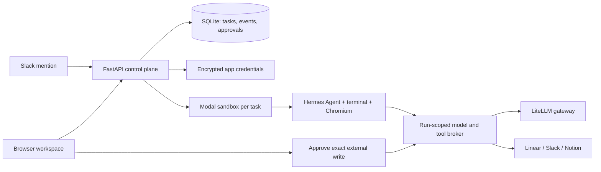
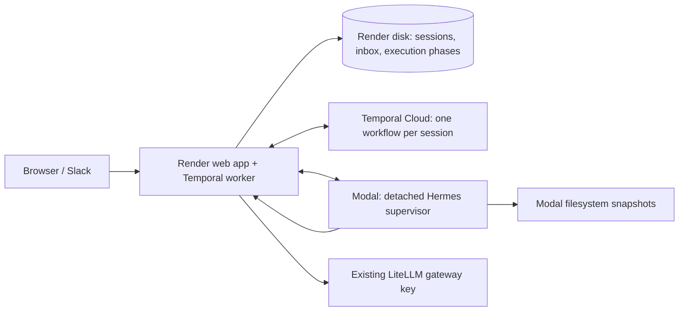

# Moyai Devin

A working MVP of an internal Devin-style workspace: assign tasks in a browser, run Nous Research's Hermes Agent in an isolated Modal sandbox, and connect Linear, Slack, and Notion.

**Cloud workspace:** [Open Moyai Devin](https://moyai-devin-litellm.onrender.com), hosted in **Organization for Litellm → Litellm** on Render; Hermes sandboxes and filesystem snapshots run under **hermes-workspace** in the **litellm** Modal workspace. Sign in with your **@berri.ai Google Workspace account**. Shared-password login is disabled. Secrets remain private in Render and ignored local environment files. Historical links below use the old origin; their session IDs are preserved on the new origin.

**Initial Slack verification:** a real @Moyai Devin mention in [#bot-spam](https://berriaillm.slack.com/archives/C0B302ZJU05/p1790720764864289) created exactly one cloud run and returned a protected link on the original Modal deployment. The agent answered `Ready`, used no connected-app tools, and its sandbox was terminated. The new chat continuation path is described below.

**Chat verification:** real session [`e391ff74341d464a9674810584eae976`](https://moyai-devin.onrender.com/#run=e391ff74341d464a9674810584eae976) completed three replies. A follow-up queued during the first response remembered a phrase and changed the same file from 7 to 12. A fresh deployment preserved the four-message transcript, snapshot, and latest file archive. A third message sent from the reopened browser chat recalled the phrase and read the file as 12. All six chat messages are saved, no connected-app tools or approvals were used, and no sandbox was left running.

**Current verification:** the hosted cloud path works with `openai/gpt-6-astra` through `https://gateway.litellm-sandbox.ai/v1`. Live acceptance run `15c6ceef68724dc6897dce5639ef9350` created Python files, ran four unit tests successfully, opened and read a page through the real Chromium MCP tool, returned a downloadable archive and screenshot, streamed 20 activity events without decoding errors, and confirmed sandbox termination. The configured key's model catalog also includes `anthropic/claude-opus-5-5`; Astra is the current default.

Local/cloud sign-in, protected APIs, demo tasks, Docker startup/restart, and cloud history restoration after redeployment passed. The 142 automated tests cover approvals, OAuth state, model restrictions, answer preservation, checkpoint recovery, activity framing, cancellation, recovery archives, and Slack conversation/reaction routing using simulated providers. A real provisioning-cancellation check confirmed task cancellation, token revocation, and sandbox exit. Demo events are explicitly labeled and never execute agent code.

**Live app setup:** all three dedicated integrations are connected: Linear with Read, Create comments, and Create issues for LiteLLM-prod only (Linear’s Create issues scope also allows issue updates); Slack OAuth for BerriAI with search, channel/DM history, and posting scopes, with token rotation enabled; and Notion OAuth for LiteLLM with Read and Insert content, without editing existing content or user-profile access. At the user's request, Notion was granted every available page under Teamspaces, Shared, and Private, including their children. Notion only offers pages where the authorizing user has Full Access; this does not grant access to other Notion workspaces or guarantee access to future top-level pages.

Live integration acceptance run `16f17267a9f749cb8063a5aa5d38d76c` used real Hermes with Astra in a Modal sandbox. All six native calls succeeded: search and read for each of Linear, Slack, and Notion. The run created a downloadable report, requested no writes or approvals, and finished with zero active sandboxes. A final redeployment preserved all three connections, both completed acceptance runs, and their downloadable artifacts; unauthenticated APIs still returned 401. See [integration verification](../hermes-integration-verification.md) and [result archive](../hermes-integration-test.zip). Search results are paginated and large tool outputs can be truncated; this verifies connectivity and selected targets, not exhaustive search coverage or complete Notion content retrieval. External writes have not been exercised against real accounts.

A separate deterministic runtime check also passed: the real Hermes conversation loop consumed streamed tool calls, invoked Chromium through the actual workspace MCP bridge, returned a result, and cleaned up its sandbox. That check used a test model fixture, not an AI provider.

## Render web app with Modal sandboxes

**Live migration verified September 29, 2026:** all 12 existing sessions, 14 messages, three organization connections, saved filesystem snapshot IDs, Slack source context, and 10 byte-identical result archives moved to Render. All three provider health checks passed. The existing continuity chat resumed on a new Modal sandbox and recovered “blue lantern” and file value `12`. A real [#bot-spam thread mention](https://berriaillm.slack.com/archives/C0B302ZJU05/p1790733863830609?thread_ts=1790733854.157109&cid=C0B302ZJU05) created [a Render session](https://moyai-devin.onrender.com/#run=b371989dcc8842fdad936f5784beec7f), automatically read two source messages, and answered the marker `river-stone-73`. No external writes were requested. Both sandboxes terminated. The old Modal web deployment is stopped; its Volume remains a frozen migration backup. Existing workspace passwords are unchanged. A second Render deployment, with bootstrap disabled, preserved all 13 current sessions, 18 messages, 11 archive checksums, saved snapshots, and organization connections. Unauthenticated APIs still returned 401, and no Modal sandbox remained running.

`render.yaml` defines the company Render Python service in Oregon with 1 CPU / 2 GB memory and a 1 GB persistent disk ($25.25/month base plus usage). Render hosts the browser UI, encrypted app connections, Slack webhook, SQLite history, and approval broker. Agent machines, filesystem snapshots, and Chromium still run in Modal. Service automatic deploys and Blueprint automatic synchronization are disabled because deployments interrupt active chat turns; check for active sessions before deploying. Manually sync the Blueprint after reviewing configuration changes, then deploy the intended commit. Keep one web instance. Render's disk forces stop-before-start deployments, preserving the single-writer database requirement.

The deployed Blueprint sets `RENDER_MIGRATION_STAGE=false` and leaves `BOOTSTRAP_MODAL_VOLUME` empty now that the import is complete. For a fresh migration, `render_start.py` defaults to staging mode unless explicitly configured. The health endpoint is available, but sessions and Slack events are refused until cutover. Configure the existing environment secrets privately in Render; preserve `ENCRYPTION_KEY`, both workspace passwords, and `SESSION_SECRET`. `PUBLIC_URL` comes from Render's own `RENDER_EXTERNAL_URL`; Modal proxy rewriting and Modal Volume checkpoint writes are disabled on Render.

For cutover, wait for every old session to settle, stop the old Modal web service cleanly, then set `RENDER_MIGRATION_STAGE=false` and deploy on Render. On the first live startup, `BOOTSTRAP_MODAL_VOLUME=hermes-workspace-state` copies the final SQLite checkpoint and its result archives onto the Render disk. It validates the database, rejects checkpoints with active runs, and publishes the database only after all archives transfer. Existing Render data is never overwritten. After a successful import, remove the bootstrap environment variable to prevent accidentally restoring stale data onto a replacement disk.

Update the Slack Events request URL and Slack/Notion OAuth redirect URLs to the new origin, then verify a real Slack mention and an existing chat follow-up. Keep the original Modal Volume as a migration backup. If reverting after accepting new work on Render, export the current Render database and artifacts first; the frozen old Modal checkpoint is no longer current.

## Agent Traces in LiteLLM

Set `LITELLM_TRACE_ENDPOINT=https://gateway-dev.litellm-sandbox.ai/v1/traces` and a
dedicated `LITELLM_TRACE_API_KEY` in Render's private environment. Both are required;
leave the key empty to disable export. The inference gateway and its key remain
configured separately through `LITELLM_API_BASE` and `LITELLM_API_KEY`.

The control plane sends standard OTLP/HTTP protobuf with the OpenTelemetry SDK.
Each response produces a `moyai-devin` agent span containing the task and final
answer, with child model and tool spans including timing, status, token counts,
and bounded tool inputs/results. Follow-ups have separate trace IDs and a shared
session ID. Active delegated agents attach beneath their coordinator; machine
renewals retain the current turn's trace identity. Sandbox events never receive
the trace credential and trace payloads are separate from public chat activity.

System prompts, loaded skills, private reasoning, images and credential-tool
payloads are excluded. Known credentials and common secret fields are redacted;
ordinary task/tool text is sent to the configured gateway. Text is capped at
16,000 characters per field. Export is best effort through a bounded SDK queue:
an exporter outage or process crash can lose spans but does not fail the task.

The destination must enable `general_settings.tracing.store: clickhouse` and
`CLICKHOUSE_URL`. ClickHouse is required for Agent Traces itself. A Lens worker
is only needed for automated investigations. After deployment, run a short task
that uses a file or terminal tool, open **Logs → Agent Traces**, and look for
`moyai-devin`; verify the task, tool result and final answer in the trace tree.

## Start locally

Requires Python 3.12+ and [uv](https://docs.astral.sh/uv/).

```sh
cp .env.example .env
uv sync --frozen
uv run uvicorn app.main:app --host 127.0.0.1 --port 8787 --workers 1
```

Open **http://127.0.0.1:8787**. Start a demo task, inspect its activity, or stop it. History survives server restarts in `.data/workspace.db`.

Values explicitly present in this project's `.env` take precedence over shell environment variables, including an empty value. This prevents accidentally using an unrelated globally configured gateway key. Container deployments do not include the `.env` file and use their configured environment/secret store.

Use exactly **one server process**. The MVP owns its job queue and runner in that process. Do not use multiple Uvicorn workers, multiple containers sharing the database, or development auto-reload while real runs are active.

## Google Workspace sign-in

**Live and verified September 29, 2026:** Google-only sign-in is enabled. A real `tin@berri.ai` login reached the existing workspace as an administrator; all 14 saved chats and three organization connections were retained. The previous password and previously issued password sessions were verified to return no access. The dedicated Internal OAuth app is in BerriAI’s `protean-chassis-510202-k5` project. The 74 automated tests pass.

Moyai supports Google OpenID Connect login restricted to configured Google Workspace domains. Create an **Internal** OAuth app in BerriAI’s Google Cloud organization, then a **Web application** client with the exact redirect URI `https://moyai-devin-litellm.onrender.com/auth/google/callback`. Configure `GOOGLE_CLIENT_ID`, `GOOGLE_CLIENT_SECRET`, `GOOGLE_ALLOWED_DOMAINS=berri.ai`, and `GOOGLE_ADMIN_EMAILS=tin@berri.ai` privately on Render. Additional administrator emails are comma-separated. Other verified BerriAI identities become members and use the existing shared connections without individual provider authorization.

Administrators can manage roles inside Moyai under **Users**. Search teammates, choose **Change role**, and save **Admin** or **Internal user**. **Add user** can assign a role to an allowed-domain email before its first sign-in; it sends no invitation and does not create a Google account. The person still needs verified Google SSO. Known eligible Slack profiles also appear, without granting Slack identities web authentication.

Roles saved in the app take precedence over `GOOGLE_ADMIN_EMAILS`. That environment list remains the default for emails with no saved assignment, preserving existing admins on rollout. App assignments and their audit trail live in the durable workspace database and survive deploys. Updating the environment alone does not undo an explicit app demotion. Keep at least one valid bootstrap admin configured; use the Users page for day-to-day changes. Role changes take effect on the next authenticated request (refresh an open page to update its controls), including agent organization-skill writes. Admin-only API checks, CSRF protection, stale-edit detection, and a serialized last-admin check prevent unauthorized promotion and concurrent lockout. Admins can demote themselves after another admin is available. Personal skills and secrets keep their existing ownership rules.

Keep `PASSWORD_LOGIN_ENABLED=true` for initial setup. After a real Google administrator login succeeds, set it to `false` and redeploy; this disables password login and invalidates existing password sessions. Preserve `SESSION_SECRET` and `ENCRYPTION_KEY` and existing data during the change. Domain, OAuth client, and administrator-policy changes are checked on subsequent requests. Google sessions last at most 12 hours; Google account suspension is checked on the next Google authentication, not through directory synchronization.

The server verifies Google’s signature, issuer, audience, expiry, nonce, verified email, and hosted-domain claim. Login state is single-use, expires in ten minutes, is bound to the initiating browser, and uses PKCE. Return destinations are restricted to known local app routes. Google login requests only `openid email profile`; Google API access and refresh tokens are not stored. Passwords, authorization codes, and identity tokens must not appear in logs or screenshots. Existing app permissions and administrator-only external write approvals are unchanged.

## Chat interface

The browser opens into a conversation workspace with searchable sessions in the sidebar, a centered new-session composer, and a full-height chat with the composer fixed below the conversation. Enter sends; Shift + Enter adds a line. Unsent follow-up drafts remain with their session while switching chats. Activity opens the session's progress, Slack source context, and file download in a collapsible panel. Pending write approvals remain visible beside the composer.

The sidebar lists the 100 most recently updated parent sessions first, using the same last-updated time shown beneath each title. New messages and session state changes update this time; simply opening a session does not. Subagents stay nested under their parent in assignment order. The list refreshes every 15 seconds, and a selected older session remains accessible beyond the list limit.

Assistant replies render Markdown headings, lists, links, tables, and copyable code blocks. The pinned local Marked and DOMPurify libraries are listed with their source tarballs and hashes in `app/static/vendor/versions.json`; licenses ship alongside them. Raw HTML is escaped, the resulting markup is sanitized, and only HTTP(S)/mailto links are enabled. No external script or image is loaded to format replies.

Browser acceptance covered desktop and a 390px narrow viewport, session search, multiline input, Enter-to-send, queued follow-ups, per-session drafts, live status, activity controls, and hostile HTML/URL rendering. The 49 existing automated tests pass.

## What is implemented

| Area | Behavior |
| --- | --- |
| Chat sessions | Start a conversation, send follow-ups while work runs, revisit saved messages, see live tool progress, stop a response, and download the latest files. Follow-ups queue in order; duplicate sends do not run twice. |
| Cloud execution | Dedicated 2 CPU / 4 GB Modal sandbox for each run; bounded concurrency; no app duration or iteration cap by default; automatic machine renewal; optional full VM runtime. The entire Hermes process runs inside the sandbox. |
| Hermes | Source pinned to commit `7968c72a3cb80beaae51948378944dd6e3423b96`; dependencies prepared through Hermes PM; terminal, file, and workspace MCP tools. |
| Model access | OpenAI Chat Completions through your LiteLLM-compatible gateway. The control plane pins the model, caps output and request count, and keeps the model key outside sandboxes. |
| Native connections | First-class Linear, Slack, Notion, and GitHub cards; OAuth when app clients are configured; validated personal/integration-token alternative; encrypted token storage and OAuth refresh. |
| Organization controls | Shared connections, separate admin/member access, enabled/paused and read-only policies, health checks, and an audit history of connection changes. |
| Slack sessions | Mention @Moyai Devin in a channel the bot has joined. Signed, deduplicated events start one saved session per thread. AgentChat routes mentions, thread follow-ups, and direct messages into saved conversations. Threads show native working status, then the answer; plain DMs retain eyes acknowledgment. |
| External writes | Exact arguments appear for one-time admin approval. Denied/expired actions are not sent. Ambiguous write failures are recorded as uncertain and never retried automatically. |
| Agent browser | Isolated headless Chromium with open/read/click/fill tools over MCP; latest screenshot returned in the result archive. |
| Results | Summary, tracked changes as a patch, eligible new files, and latest browser screenshot. Up to 2 MB per artifact file / 15 MB collected content / 20 MB archive download. Hidden files and symlinks are skipped. |
| Saved workspace | Each response saves Hermes conversation history and a Modal filesystem snapshot. With Temporal, follow-ups reuse the sandbox for five idle minutes; later responses restore saved files and tool history. Warm sandboxes consume compute. Filesystem snapshots do not preserve running background processes or browser tabs. |
| Restart handling | Saved chats and workspace snapshots survive deployments. Unfinished responses/queued messages are interrupted, capabilities revoked, and known sandboxes cleaned up. Send a new message to resume from the last saved workspace; unfinished external actions are never silently replayed. |

## Enable cloud runs

The cloud sandbox calls back to this server for model and app tools, so `PUBLIC_URL` must be a **reachable HTTPS address**. Loopback URLs deliberately keep cloud execution disabled.

Set these in `.env` or your host's secret store:

```dotenv
PUBLIC_URL=https://your-workspace.example.com
WORKSPACE_PASSWORD=<at-least-16-characters>
MODAL_TOKEN_ID=<your-modal-token-id>
MODAL_TOKEN_SECRET=<your-modal-token-secret>
LITELLM_API_BASE=https://your-gateway.example.com/v1
LITELLM_API_KEY=<a-dedicated-budget-limited-key>
AGENT_MODEL=<your-gateway-model-name>
```

Also set stable `SESSION_SECRET` and `ENCRYPTION_KEY` in cloud deployments. The example file includes generation commands. If omitted, they are generated privately under `DATA_DIR`; preserve that directory together with the database.

Restart the server and check **Runtime**. Cloud mode becomes selectable only when configuration is complete. The first run builds and caches the Hermes image and may take several minutes. This readiness check confirms configuration, not successful authentication or a completed image build.

The default Modal sandbox uses container isolation. Set `MODAL_VM_RUNTIME=true` to opt into Modal's VM runtime beta when a workload needs a full Linux kernel. This flag does not install Docker or provision nested VMs for you.

### Deploy the control plane

The included `deploy_modal.py` hosts the browser app on a **Modal Server** in the same workspace as the agent sandboxes:

```sh
uv run python deploy_modal.py
```

The deploy command reads `.env`, generates missing workspace/session/encryption secrets privately, updates the dedicated `hermes-workspace-config` Modal Secret, and deploys `moyai-devin`. It prints the actual HTTPS URL. The app resolves that URL on startup and validates Modal's forwarded hostname against that exact origin. Keep one server container (`min_containers=1`, `max_containers=1`) and the `recreate` deployment strategy. The product name and host are Moyai Devin; internal secret/volume names retain the original `hermes-workspace` prefix to preserve credentials and history. When migrating to another app name, first stop the old app and verify its containers have exited before deploying a new writer against the same volume. This is an always-on service and incurs Modal usage while deployed; stop it in the Modal dashboard when no longer needed.

SQLite runs on the container's local disk. Complete database snapshots and the latest per-session result archives are committed to the `hermes-workspace-state` Modal Volume. API mutations are checkpointed before acknowledgement, and background activity is checkpointed every two seconds. A hard failure can lose the newest background events. Starting a replacement restores the last snapshot and interrupts unfinished tasks without replaying external writes. Do not scale the service above one container or use rolling deployments; a distributed worker/database design is needed for multiple writers. Redeployments interrupt active tasks.

The authorized Modal token expires on **October 6, 2026**. Sandbox provisioning uses this token. Replace it privately in the Render environment and local `.env`, then deploy when sessions are idle before expiry to keep cloud tasks working. Use a managed service identity and your own operational policies for a longer-lived team deployment.

### Alternative: Docker on an existing cloud host

The included Docker image runs the control plane on an always-on cloud VM or container host. Modal supplies the task sandboxes separately.

```sh
docker compose up --build -d
```

The compose port binds only to the cloud host's loopback interface. Place an HTTPS reverse proxy in front of port 8787, set `PUBLIC_URL` to its exact origin, and preserve the incoming Host header. Allow `/broker/` traffic from Modal with its run-scoped bearer tokens. Disable proxy buffering for event streams and allow requests lasting up to 16 minutes for human approvals. Set an appropriate body-size limit (5 MB) at the proxy.

Use one replica with a persistent local disk. Avoid serverless request hosts that stop background work after an HTTP response. The Docker image was built and its task creation and restart persistence were verified locally. This alternative has not been deployed to a separate VM.

## Connect the apps

New browser sessions select all enabled connected apps by default; uncheck an app to exclude it from that session. No per-user provider sign-in is required.

Connections are **shared by the LiteLLM organization** and retain the permissions of their authorizing identity. The deployed app uses verified BerriAI Google SSO; password sign-in is a configurable fallback. Members can start sessions and use enabled connections. Only admins can manage connections, change access policies, view spend, link Slack identities, or approve external writes. This is a single-organization trusted-team MVP with shared session visibility.

Open **Organization** and either enter the appropriate token or use the OAuth button after configuring the provider's client ID and secret. Tokens are checked with the provider before being saved. Disconnect removes the locally stored credential; revoke the integration at the provider as well if you want to terminate its authorization there.

| App | Required setup | Tools exposed |
| --- | --- | --- |
| Linear | Personal API key, or OAuth app with `read,write`; callback `PUBLIC_URL/oauth/linear/callback`. | List accessible teams (50 results), search issue titles (20 results), read an issue, create an issue or add a comment after approval. Creating issues requires the credential’s Create issues permission (Linear also permits updates under that scope). |
| Slack | User token with `search:read`, relevant channel/DM history scopes, and `chat:write`; or a Slack OAuth app with those **user** scopes and callback `PUBLIC_URL/oauth/slack/callback`. Bot tokens cannot search messages. | Search messages (20 results), read a thread (50 messages), send a message after approval. |
| Notion | Integration token with content access and the target pages shared to it; or public integration OAuth client with callback `PUBLIC_URL/oauth/notion/callback`. | Search page titles (20 results), read up to 100 top-level blocks, append a paragraph after approval. |

Set `LINEAR_CLIENT_ID` / `LINEAR_CLIENT_SECRET`, `SLACK_CLIENT_ID` / `SLACK_CLIENT_SECRET`, and/or `NOTION_CLIENT_ID` / `NOTION_CLIENT_SECRET` to show native OAuth buttons. Provider administrators may need to approve the apps and scopes. Notion search is title search, not full-text search; nested page blocks and subsequent result pages are not automatically expanded in this MVP.

This application registers its own app integrations. It does not reuse or copy credentials from the Codex/ChatGPT connectors in this chat.

## Choose the model

**Live verification:** session [`9d137408acbc4254a1c6fbbf7e86aa77`](https://moyai-devin.onrender.com/#run=9d137408acbc4254a1c6fbbf7e86aa77) ran **Opus → Astra → Opus**. Opus remembered `copper lighthouse` and wrote `21`; Astra restored the conversation/file, incremented it to `22`, and a queued Opus turn read `22` and recalled the phrase. The picker changed to Opus while the active turn stayed on Astra. All three answers have model labels, connected apps were deselected, and all three sandboxes confirmed termination. The `@Moyai Devin model opus` command was also verified in the existing #bot-spam test thread without starting compute.

Use the model picker in the new-session composer or below an existing conversation to choose **GPT-6 Astra** (`openai/gpt-6-astra`) or **Claude Opus 5.5** (`anthropic/claude-opus-5-5`). The choice applies when you send the next message and becomes that session's preference. Your conversation and saved workspace stay together across a model switch. Each new assistant answer records its model; old answers without a stored model are left unlabeled.

Every queued message captures its model at submission. Changing the picker or Slack preference does not reroute a response already running or queued. The gateway broker pins each turn to its selected, allowed model and ignores any model override supplied by sandbox code. `AGENT_MODEL` sets the default; `AGENT_MODELS` configures the picker allowlist. Gateway credentials must have access to each enabled model.

In Slack, mention the bot with `model opus` or `model astra` to set the model for that thread's next messages. You can start with a model directive on the first line and the task on the next line, for example:

```text
@Moyai Devin model opus
Read this thread and suggest the next step.
```

A model-only command starts or updates the saved session without launching a sandbox. Its confirmation does not change running or already queued turns. These commands also work in DMs. Include the bot mention on channel follow-ups if the installation has not yet enabled ordinary thread events.

## Per-user model spend

**Live verification (September 29, 2026):** deployed commit `87aa874` on Render. Session [`9895bd3b52a9403a988f4dc06c7545dd`](https://moyai-devin.onrender.com/#run=9895bd3b52a9403a988f4dc06c7545dd), started by `tin@berri.ai`, completed an Astra response, then an Opus follow-up that recalled `granite-27`, wrote a local file and read it back. Three successful inference responses supplied `x-litellm-response-cost`: `$0.061130000000000004`, `$0.037141`, and `$0.0042726`, totaling `$0.102543600000000004` (displayed as `$0.102544`). User, session and model totals agree. Both successful turns saved filesystem/conversation snapshots and terminated their Modal sandboxes. The admin UI exposed the exact header amounts; unauthenticated spend access returned 401 and the removed callback route returned 404.

Initial verification exposed LiteLLM's rejection of request-level `turn_off_message_logging`. Moyai no longer sends that option; gateway security settings were not changed. Seven rejected attempts remain visible as unknown cost, rather than assigning an invented zero. A separate minimal diagnostic request cost `$0.00029` on the same key, outside the Moyai session ledger. The gateway still has no key-scoped logging integration, and `allowed_routes` remains `llm_api_routes`. The full 110-test suite passed before deployment; all 22 spend/model tests passed after the logging-policy correction.

Administrators can open **Spend** in the sidebar to see USD model costs by user, session and model, with UTC date filters (up to 93 days). Google sign-in registers a stable account using the verified Google subject, so an email/name change does not create a different billing identity. New sessions record their creator; every queued message independently records its sender. A response, including its tool loops, retries and context compression calls, is attributed to that sender even when another teammate queues the next message. Conversations retain shared-workspace visibility; this adds ownership and accounting, not private chats.

Each model call is durably reserved before reaching LiteLLM, with the active message sender, session, selected model and existing key fingerprint. Sandbox-supplied attribution is ignored. All requests use the same existing gateway virtual key; SSO user/session accounting stays inside Moyai. No new gateway users, keys, callbacks or reporting permissions are required.

Moyai saves the finalized `x-litellm-response-cost` from the inference response, falling back to an explicit `x_litellm_response_cost` in final usage when present. These are gateway-reported costs, not token-price estimates. Token counts are retained for context; cache pricing and other gateway pricing rules are already reflected in its returned cost. Decimal costs are stored as strings and summed without binary floating-point rounding.

Because streamed HTTP headers arrive before generation finishes, the broker requests a non-streamed completion from LiteLLM. It saves the final cost and usage before returning that response, adapting completed text/reasoning/tool calls to the Chat Completions SSE protocol when Hermes requests streaming. Tool and session activity still update live; individual inference tokens are delivered together after completion. If a sandbox stops while an already-submitted inference completes, its returned cost is still recorded. Unknown costs remain visible, separate from explicit zero-cost responses.

User totals add up to costs returned for tracked Moyai requests; the dashboard shows coverage and expandable exact per-request amounts. This does not audit the key's entire lifetime spend: earlier usage, calls outside Moyai, gateway-internal billed attempts not reflected in the returned cost, and interrupted requests without a final response cannot be recovered from response headers. Tracking starts at rollout. Key rotation retains previous accounting rows but the page displays the currently configured key. Demo sessions incur no model spend. Render hosting and Modal compute/storage charges remain separate.

Slack messages capture the sender from verified Slack events. With `SLACK_IDENTITY_LINKING_ENABLED=true` (default), Moyai looks up a sender’s Slack profile in the background on first use, creates a local profile labelled with their company email, and automatically links it to a unique Google identity with that exact email. Slack-first and Google-first usage both work: a first Google login combines earlier Slack spend automatically. Original message, session-owner, and inference sender IDs remain immutable; automatic and manual link changes are audited.

Reconnect the dedicated Slack app with **bot scopes `users:read` and `users:read.email`** to enable lookup. Existing senders with recorded sessions/messages are backfilled automatically; **Spend → Slack identities → Refresh profiles** queues a recheck. Profiles are refreshed daily, with failures retried after five minutes. Missing permission or lookup failure never blocks a chat. Only members of the installed Slack workspace with an email in `GOOGLE_ALLOWED_DOMAINS` qualify; guests, external Slack Connect users, bots and deleted users do not. Emails are trimmed and lowercased, without alias, dot or plus-address normalization. Email changes and ambiguous matches require administrator review; automatic matching never retargets an existing link, and explicit admin overrides survive refreshes. The secondary **Administrator overrides** controls remain available for exceptions.

This is **just-in-time identity provisioning and accounting linkage**, not SCIM: it does not create a Google Workspace account, grant a web session or administrator role, or synchronize directory groups and deprovisioning. Web access still requires verified Google OIDC login. Before that first Google login, the Slack-created profile and its spend appear under the company email.

**Activated September 30, 2026:** the approved profile/email scopes are installed on BerriAI’s dedicated Moyai app and the encrypted organization connection was refreshed. Live backfill resolved all four existing session senders: one retained its admin-selected Google link; three received company-email profiles awaiting their first Google login. The recorded total remained unchanged. The migration preserved all 26 sessions and has a private pre-migration SQLite backup on Render. Validation: 186 Python tests and three chat-stream tests passed; automatic matching in both sign-in orders was covered in tests, while live verification covered real Slack profile lookup and preservation of the existing link.

## Recovery from code-content connection failures

A production failure on LIT-6275 exposed an edge-firewall false positive: the first inference and Linear read succeeded, but the saved conversation containing the issue’s code/reproduction examples received Cloudflare HTML `403 Blocked` before reaching the Render app. Every follow-up restored that same context and failed again. An isolated copy of the actual snapshot reproduced this: plain JSON returned the expected capability `401`, while the saved conversation returned `403`.

The sandbox now runs an authenticated loopback adapter for Hermes and MCP. Requests cross the public edge as Fernet envelopes bound to a fresh run capability and exact route, with a five-minute validity window. Render authenticates the active run **before** decrypting and keeps its model allowlist, sender accounting, input validation, size limits, tool policies, and exact-action approvals. No gateway credentials enter the sandbox, no extra gateway key is created, and no firewall setting is changed. Restored sessions receive the updated adapter files, preserving user files and history. The exact previously blocked conversation passed the edge after this transport change.

Slack context is included once instead of being appended again on every follow-up. Failed assistant turns retain their failure status and appear as failures in Slack and the web UI. Connection failures give an actionable explanation instead of guessing about the user’s model API key. For issue follow-ups, the agent checks for an existing fix PR and uses the shared GitHub App to prepare a normal PR for administrator approval when enabled.

**Verification:** 124 automated tests passed, including encrypted model/tool requests, unchanged gateway costs and identity attribution, tampered/expired/wrong-route rejection, revoked capability rejection, and continued admin approval requirements for writes. Commit `046c317` was deployed to Render. The actual failed conversation resumed from its saved snapshot, re-read the Linear issue, and identified merged PR [#38416](https://github.com/BerriAI/litellm/pull/38416), shipped in v1.100.0. Its answer arrived in the original Slack thread. A subsequent Slack reply without an issue identifier received the correct contextual answer in the same web/Slack session. The spend dashboard attributed the repaired calls to the sender’s linked Google identity. Both turns saved their snapshots and stopped their sandboxes; a Modal SDK check found zero active sandboxes under `hermes-workspace` after verification.

## Chat with Moyai in Slack

Channel threads and explicit DM threads now show Slack’s native **“Moyai Devin is working…”** indicator instead of an eyes-only acknowledgment. It reflects the session phase (starting, working, saving, waiting for approval/key, or coordinating agents), refreshes every minute during long work, and clears on completion, stopping, or pausing. Slack expires an abandoned indicator after two minutes. State is reconciled after restart; temporary status failures are safe to retry without replaying the agent or its answers. Web follow-ups in linked sessions also restore the indicator. Plain top-level DMs retain eyes acknowledgment and top-level replies, since Slack’s status API would otherwise open a thread where the reply is not delivered. Session links use a compact footer below each answer.

This uses AgentChat’s optional `set_status` API with Moyai’s persisted session state. Standalone SDK apps can use `async with context.working()` for refresh and cleanup within a handler. Existing Slack `chat:write` / `assistant:write` permissions suffice; no new scopes are requested.

**Live reaction-first verification (September 30, 2026):** commit `bb7186e` deployed successfully to Render. The existing BerriAI connection was reauthorized with `reactions:write` and `assistant:write`; no additional history or file-reading scopes were added. Slack's native Agent experience is enabled and the new logo is installed. In the [#bot-spam test thread](https://berriaillm.slack.com/archives/C0B302ZJU05/p1790788399573509), Moyai reacted with eyes to the initial mention and to an ordinary reply without another mention. It answered `Ready.` and then recalled `cedar-comet-91`, with exactly two answers and no acknowledgment or periodic progress posts. Both turns used the same [saved session](https://moyai-devin.onrender.com/#run=ab6034c09c3949d998e20156248c3361), which returned to idle with two model calls and a saved filesystem snapshot. The visible replies show the native **AGENT** badge and Moai logo. A Modal API check confirmed zero active sandboxes under `hermes-workspace` after both turns. See [live screenshot](../moyai-reaction-agent-live.jpg). Agent-panel thread isolation is covered by automated tests; this acceptance run tested a channel thread.

The app uses the custom Moai profile and Devin-inspired three-node mark in `app/static/favicon.svg`; a 1024px PNG for Slack is in `app/static/moyai-devin-logo.png`. The SVG is the editable source.

Moyai uses [BerriAI AgentChat](https://github.com/BerriAI/agentchat), pinned to `bf38f1044a5feb38d836610cf0fb974f311c0477`, for normalized messages, conversation locks, handler dispatch, and replies. Its stock Slack adapter uses Socket Mode; Moyai keeps its signed HTTP event endpoint. Our public Channel/State adapter preserves the existing signed HTTP webhook, rotating OAuth credentials, SQLite receipts, saved sessions, and durable reply outbox. No Socket Mode app token is required. AgentChat does not grant Slack permissions; an administrator still installs the scopes and event subscriptions below.

**Live AgentChat verification (September 29, 2026):** commit `4b2e339` deployed successfully to Render. The approved `message.channels`, `message.groups`, and `message.im` subscriptions and matching bot history scopes were installed; App Home allows direct messages. All 117 automated tests, JavaScript/Python checks, a clean Docker build, and production dependency imports passed.

A [normal #bot-spam reply without a mention](https://berriaillm.slack.com/archives/C0B302ZJU05/p1790745129700469?thread_ts=1790740160.956979&cid=C0B302ZJU05) continued the existing session `35f33e443f214d159978842947ed69d8`, recalled `cobalt-otter-58`, and recovered file value `12` after the deployment. A [direct-message session](https://moyai-devin.onrender.com/#run=07eca0ea76204f44be44afbcf38e73bb) started with Astra, saved `19`, then continued with Opus, recalled `amber-puffin-84`, and saved/verified `23`. Both responses appeared directly in the DM and linked to the same web session. Tin’s observed Slack identity was linked to `tin@berri.ai` for combined accounting. Existing 18 sessions and all three connections survived; only the new DM added a session. No connected-app writes were requested. Modal’s API confirmed zero active sandboxes under `hermes-workspace` after completion. Private-channel scope installation is verified, but no live private-channel message was sent in this acceptance run.

See [thread screenshot](../moyai-agentchat-thread-live.jpg) and [DM screenshot](../moyai-agentchat-dm-live.jpg).

**Live thread-chat verification (September 29):** [#bot-spam test thread](https://berriaillm.slack.com/archives/C0B302ZJU05/p1790740160956979) used one session, `35f33e443f214d159978842947ed69d8`, for two real Hermes responses posted automatically to Slack. The first read the parent marker `cobalt-otter-58` and saved a local file containing `7`; the next recalled the marker, restored the file, and changed it to `12`. Both requests used mentions. This earlier verification used mentions; the AgentChat rollout below adds ordinary thread follow-ups and DMs. No external connected-app writes were performed.


Install the dedicated **Moyai Devin** Slack app with bot scopes `app_mentions:read`, `chat:write`, `channels:history`, `groups:history`, `im:history`, `reactions:write`, and `assistant:write`, subscribe to the `app_mention`, `message.channels`, `message.groups`, and `message.im` events, and set its request URL to `PUBLIC_URL/hooks/slack/events`. Keep the user OAuth scopes above for conversation search; bot and user credentials are separate. Configure `SLACK_SIGNING_SECRET`, `SLACK_BOT_ENABLED=true`, and `SLACK_SESSION_USERS` as comma-separated Slack user IDs or `*` for all members of the installed workspace. Set `SLACK_THREAD_CHAT_ENABLED=true` and `SLACK_DM_ENABLED=true` (the defaults). Enable App Home’s Messages tab and allow users to send messages to the app. Enable the **Agent experience** under Slack app settings → Agents for the native AGENT badge and panel. Reinstall/reconnect Slack after adding scopes. The live BerriAI installation permits workspace members.

Invite the bot to a channel and mention **@Moyai Devin** followed by a task. Moyai shows a native working indicator, then posts its answer in the originating thread with a compact link to the web session. Routine acknowledgment and periodic progress messages are suppressed; explicit status commands, failures, and approval requests still receive a response. Reply in that thread without another mention to continue the same saved conversation and files. Bot messages, edits/deletes, unrelated threads, and externally shared channel events are ignored. A message addressed first to another person or agent is ignored even when Moyai is mentioned later as the subject, such as “@OtherAgent what is @Moyai?” Explicitly addressing Moyai among adjacent initial mentions still works. Attachments are identified as unread; their contents are not ingested automatically.

Direct-message **Moyai Devin** to start without a mention. Subsequent DMs reuse the same saved conversation and files; replies appear directly in the DM. A DM begins with the current request and saved session history, without importing older DMs through the shared search account. One-to-one DMs are supported; group DMs are ignored. Each DM is bound to its original Slack sender, and each turn keeps that sender’s spend attribution. **DM sessions are also visible to signed-in BerriAI teammates in the web app.** The first answer and Connections page explain this shared visibility. Separate threads in Slack’s Agent panel keep their own sessions and reply within the originating thread, while ordinary top-level DMs continue their existing session.

Tasks use enabled organization connections. Everyone with access to the Slack thread can see both new inputs sent from its linked web session and the agent’s answers. Web inputs are posted by the bot with the authenticated sender’s name/email and a “via Moyai web” label; the bot never impersonates their Slack account. The web composer shows this sharing state. External app writes still need an administrator to approve the exact action in the signed-in web app; saying “yes” in Slack cannot approve a write.

Send `stop` to stop the response and cancel queued follow-ups; `sleep` also pauses listening and automatic answers in that thread. Use `wake` or a new direct mention to resume. `status` reports the session state. These commands must be the entire message. Pausing the organization Slack connection disables thread intake and pending replies.

Inbound receipts, working-status reconciliation, DM acknowledgment reactions, and the outbound reply queue are durable. Reactions are bound to accepted message timestamps; failures to react do not block answers. The bot treats an existing identical reaction as success. Pending pre-upgrade acknowledgment/progress messages are skipped on startup. Duplicate event IDs or paired mention/message events cannot create duplicate turns. Answers are bounded, formatted for Slack, and prevented from triggering user/channel mentions. An uncertain Slack delivery is not automatically retried; the answer remains in the web app. Rollout never posts historical answers: older threads are attached only after a new explicit mention. Answers completed while a thread is asleep are not backfilled on wake. New web inputs are saved atomically with their outbound chunks only while the Slack binding is enabled and awake. Existing web messages and inputs typed while sharing is paused are never backfilled. Duplicate submissions reuse their original queue entries, and long inputs preserve the saved text across ordered chunks. Mirrored bot posts do not start a second agent turn.

Before agent execution, Moyai reads the Slack discussion through the **user OAuth** connection. A thread mention captures the root and replies through the mention timestamp (up to three pages, retaining at most 50 messages); a top-level mention captures the nearest 30 channel messages through that timestamp. Context is bounded to 24,000 text characters, with at most 3,000 per message. Truncation, missing context, and unread attachments are explicitly reported. Later messages and Moyai’s own replies are excluded. The session shows the source link and included messages. Imported Slack content is labeled as untrusted reference data, separate from the current request.

Context retrieval runs in the background so Slack acknowledgement does not wait for history requests. The session starts only after context is ready or its failure has been recorded. Captured context is persisted, reused for follow-ups, and not fetched again on duplicate delivery. Unfinished agent work is still interrupted on restart, never silently replayed. Sessions created before this update are labeled as older sessions without automatically captured context; use a new mention for the new behavior.

**Context acceptance:** a live thread mention in [#bot-spam](https://berriaillm.slack.com/archives/C0B302ZJU05/p1790731878237109?thread_ts=1790731869.212189&cid=C0B302ZJU05) created session [`972fcc321d864fb7976f45e7f0b1cce9`](https://moyai-devin.onrender.com/#run=972fcc321d864fb7976f45e7f0b1cce9). Hermes automatically read the two source messages, looked up the LiteLLM-prod team, and prepared a Linear issue with the staging 502 problem, three acceptance criteria, test reference `pebble-42`, and source link. The test approval was denied; no issue was sent to Linear. A separate [channel mention](https://berriaillm.slack.com/archives/C0B302ZJU05/p1790731894868039) created session `0d80c63ccbed4c5788dcaba7f8d67a42` and drafted the correct title and criteria from the 30-message channel excerpt without app calls or approvals. Both sessions saved their conversations and terminated their sandboxes. After the user explicitly approved expanding the credential, Linear’s Create issues permission was saved and verified in its settings, still restricted to LiteLLM-prod. The app retains per-ticket admin approval. A real issue has not been created as part of this test.

Pausing the Slack connection disables new Slack sessions. Switching a connection to read-only or pausing it also revokes pending/approved writes. It does not retract provider requests already in flight.

## Architecture



The app uses native REST/GraphQL adapters for predictable OAuth and a small tool surface. A stdio MCP bridge exposes those tools to Hermes. A sandbox gets a random capability limited to its run and enabled apps; the capability is revoked on stop, completion, timeout, or restart. It does not receive provider or Modal account credentials. Agent code and browser sessions run on Modal, never on the control-plane host.

Response states: `queued → provisioning → running ↔ awaiting_approval → saving → idle` (shown as **Ready**). A session keeps its ID across responses. Messages submitted during a response queue for the next turn; they do not interrupt an in-flight tool. Each response receives a fresh sandbox capability, including on a reused machine. Model requests remain attributed to the original user and message across renewals. After saving the latest artifact and conversation/filesystem snapshot, a completed top-level Temporal chat keeps its sandbox for five idle minutes. Follow-ups reuse it; messages already queued drain before the idle timer starts. After release, the next response restores that snapshot. Snapshot retention is indefinite; Modal storage charges may apply. Stopping ends the current response and cancels queued messages. A new message resumes the last completed checkpoint; unfinished changes may be lost. Legacy tasks created before chat support remain readable with **Run again** available to start a new chat.

New requests and follow-ups to an idle session appear directly in the conversation as soon as the server accepts them, even before a worker claims them. Only messages waiting behind another input appear in the editable queue. The next dispatch candidate follows Send now priority, then arrival order; durable queue and Temporal execution states stay unchanged. Starting a new request does not reopen the previous response's finished activity.

Public agent progress messages and interim answers appear as visible **Update** chat messages, with the same sanitized Markdown and copy controls as final replies. They remain visible when tool history collapses, after the response finishes, and on reload. Steering delivery receipts place subsequent updates after the corresponding user input; queued inputs do not capture the active task's updates. Replayed activity is deduplicated, and incoming tool events preserve existing update text and controls. Tool details remain in the shared expandable work history. The display uses existing saved events and does not create additional turns, model requests, or Slack posts. Agent guidance asks it to answer mid-task questions publicly as soon as it has enough evidence, explain any change of approach, and continue the original task unless the user changes it.

This follows the [Codex active-turn steering contract](https://developers.openai.com/codex/app-server#steer-an-active-turn): append user input to the in-flight turn, then show subsequent public replies and progress in the same conversation. Moyai uses Hermes' runtime rather than Codex App Server, so tool interruption and streaming granularity can differ; public updates appear when Hermes emits its interim-message callback, not token by token.

**Send now** (or **Ctrl/Cmd+Enter**) delivers the selected queued message as guidance for the current task. Hermes' native redirect API cancels a pending model generation and continues the same agent loop with the correction; it preserves the original objective unless the user explicitly changes it. Supported foreground terminal commands yield into Hermes' background process registry and keep running; other tools finish safely before guidance is consumed. The web transcript keeps one work timeline and final answer, with corrections labeled **Steering**, and retains edits/deletes while an input is in the queue. Normal Enter during an active response still queues a follow-up for the next turn.

Steering inputs have durable per-message receipts on Render. Repeated polls cannot inject the same input twice in a live process; receipts also travel with the next model request and the final supervisor result so a lost acknowledgment during a worker restart is reconciled. Temporal reattaches to that supervisor, not a second agent process. A correction that loses the race with turn completion stays queued. Attachments are downloaded before delivery, and image previews enter model context only after delivery is acknowledged. New model requests retain the active task's requester/model and accounting identity. Switching requester or model uses the existing checkpointed handoff to change private skill/secret scope safely; a coordinator already released while waiting for children or a credential also resumes from its checkpoint. Failed or stopped execution retains its correction messages without automatically replaying uncertain actions.

Already-submitted inference can still finish and be billed by the gateway; Render records its eventual usage against the original message even if the sandbox disconnects. Superseded model replies/errors are discarded locally and unbilled admission retries stop. Native steering keeps the current sandbox/process, so periodic and end-of-turn checkpoints still provide durable workspace recovery without a full save/relaunch on every correction.

Temporary failures reading workspace tools, model discovery, or immutable attachments retry during startup. With Temporal, an exhausted tools/attachment retry becomes a durable **Reconnecting** wait (up to `STARTUP_RECOVERY_SECONDS`, default 600 seconds), then relaunches the same message/segment with a new supervisor attempt. This requires an explicit pre-execution marker, exit code 75, no execution-started event, and no change in the model-call counter. It preserves the original requester, model, attachments, checkpoint, and queued follow-ups. Stop cancels recovery. This is a startup recovery window, not a task time limit. Permanent access/configuration errors fail immediately; generic failures and uncertain in-flight model/tool writes are never automatically replayed. Non-Temporal mode receives the read retries but does not schedule a new startup attempt.

Final answers are stored on the control-plane disk as soon as Hermes returns them, before collecting artifacts or saving the Modal filesystem. A save failure preserves the answer in web chat and Slack with an explicit warning, retains the previous snapshot, and cancels queued follow-ups. Restart recovery completes a received answer once without replaying work. A later explicit message receives the saved chat and a warning that its files may be older. The warning clears only after a successful snapshot. Recovery archives prioritize uncommitted patches and eligible new files in nested repositories over installed dependencies; they are bounded, incomplete backups and do not include newly committed history.

`RUN_TIMEOUT_SECONDS=0` and `MAX_AGENT_ITERATIONS=0` remove the app’s response-duration, tool-iteration, and model-request-count caps. Explicit nonzero values still enforce optional limits. `SNAPSHOT_TIMEOUT_SECONDS=180` separately allows three minutes for filesystem saving. Save failures now record the stage, exception type, elapsed time, configured timeout, and a redacted diagnostic reason. The original failure in session `43e5ab156ec94f31b1e8b61852be84f8` occurred after approximately 54 seconds of the old 55-second save window; Modal showed a terminated sandbox with a 15m32s lifetime and a 30m limit. The original exception details were discarded, so the exact cause is unconfirmed; the 30-minute execution limit was not reached.

Modal [limits each sandbox to 24 hours](https://modal.com/docs/guide/sandbox#timeouts). With no app time limit, `SANDBOX_ROTATION_SECONDS=82800` requests renewal after 23 hours at Hermes’s next step callback, between tool rounds. The remaining hour allows in-flight work and saving to finish. The conversation and filesystem must both be saved, all tool calls must have results, and the old machine must terminate before another machine continues the same user turn. Intermediate handoffs stay in session activity; Slack receives the final answer once. Stop, snapshot failure, incomplete tool history, and provider errors halt renewal. With the local execution engine, a server restart interrupts unfinished work without automatic replay. The optional Temporal engine below reconnects to its journaled executions. Snapshots preserve files, not live processes or browser tabs; an individual operation that cannot reach a safe boundary before Modal’s hard limit can still be interrupted.

**Live saving verification (September 30, 2026):** commit `eaf9ec5` deployed successfully to Render. A [#bot-spam mention and ordinary follow-up](https://berriaillm.slack.com/archives/C0B302ZJU05/p1790790095028019) used the same [session](https://moyai-devin.onrender.com/#run=6cda2f2a3e4e4523a4d973376e4b5b5f). The first turn created a nested local git repository, left `note.txt` changed from `before` to `after`, and added untracked `extra.txt` containing `granite-save-62`. The downloaded archive contains the correct nested patch, new file, answer, and recovery manifest with no omissions. The second turn recalled the marker and re-read both files with their unchanged git status from a restored snapshot. Both answers appeared once in Slack with reaction acknowledgments. Existing sessions and all three organization connections remained present; health returned 200, unauthenticated session access returned 401, and Modal's API confirmed zero active sandboxes under `hermes-workspace`. See [live screenshot](../moyai-save-continuity-live.jpg). Snapshot-failure, restart, queued-follow-up cancellation, and preserved-answer Slack delivery paths passed automated fault-injection tests; no failure was deliberately injected into production.

**Unlimited runtime verification (September 30, 2026):** commit `85a99c1` deployed successfully to Render with `RUN_TIMEOUT_SECONDS=0`, `MAX_AGENT_ITERATIONS=0`, and a 23-hour renewal threshold. The Runtime page displays **No app limit**. The suite passed 142 tests, including safe renewal, cancellation, save-failure, and request-attribution cases. A real Modal test using the pinned Hermes revision and a deterministic local model server used a shortened clock: one machine completed a terminal write, saved its conversation/filesystem, terminated, and a second machine restored the history and file without repeating the write. This verifies renewal mechanics, not 23-hour endurance.

A [live Slack test](https://berriaillm.slack.com/archives/C0B302ZJU05/p1790791584843379) queued an ordinary follow-up while a 45-second terminal operation was running. Both messages received one reaction and one answer in the same [session](https://moyai-devin.onrender.com/#run=91479b6674a64c27a587dd75bb34b19f), with no periodic progress messages. The follow-up recalled `basalt-queue-73`, restored the saved file containing `23`, and changed/read it back as `24`. Modal confirmed zero active sandboxes afterward. Health returned 200 and unauthenticated configuration/session APIs returned 401. See [runtime screenshot](../moyai-unlimited-runtime-live.jpg) and [chat screenshot](../moyai-queued-followup-live.jpg).

With the user's approval, the historical answer from failed run `43e5ab156ec94f31b1e8b61852be84f8` was restored to its web transcript and [posted once by Moyai in the original thread](https://berriaillm.slack.com/archives/C04HP96S19D/p1790791554484499). The recovery explicitly describes the earlier execution, failing integration tests, lack of a PR, and unsaved latest files. The original error, prior snapshot, and an audit record were retained; the coding request was not replayed.

## Verification

```sh
uv run pytest -q
node --check app/static/app.js
uv run python -m compileall -q app sandbox
```

The automated suite uses isolated temporary databases and mocked external services. It tests demo completion and SSE replay, cancellation, CSRF/host/session boundaries, repository URL validation, encrypted credentials, per-run tool scope, one-time approval and denial, uncertain writes, OAuth state binding/replay rejection, restart recovery, model-proxy restrictions, sandbox cleanup during provisioning and shutdown, admin/member restrictions, connection-policy revocation, Slack signature freshness and event deduplication, and bot/user token rotation.

Manual browser QA covers creating a task, streaming and saved activity, stopping a task, connection dialogs, runtime readiness, and responsive layout. The optional browser WebMCP tools expose listing tasks and starting explicit demos; they do not enable unattended cloud runs.

The completed cloud checks are described at the top of this document. For future releases, use this acceptance checklist with configured accounts:

1. Submit a small task against a public test repository in Modal mode; confirm the image builds, Hermes invokes a terminal tool, and results stream back.
2. Confirm the model gateway records the configured model/key and budget.
3. Connect each provider and run one search/read. Test live writes only with an explicitly authorized disposable destination; approval, denial, and ambiguous-write handling are covered by the automated suite, but real provider writes remain unverified.
4. Open a public page with the agent browser and download its screenshot.
5. Stop a real task during provisioning and while running; verify Modal shows no remaining sandbox after cleanup/timeout.

## Scope and next steps

The current boundary is a single shared internal workspace. A GitHub App supports the configured repository, including private code, with approved PR creation. Per-user app grants, a live remote-desktop viewer, and multi-instance database storage are not included. Files and conversation resume between turns; running processes and live browser tabs do not.

For a broader team rollout, extend the existing Google SSO with per-user session authorization, move orchestration to a durable worker service with Postgres, and verify live writes against explicitly authorized disposable destinations. Keep a budget-limited LiteLLM key: request-count and output limits do not substitute for a currency budget. Network egress from the sandbox is not restricted to an allowlist, and downloaded source/app content remains untrusted input to the agent.

An encrypted database alone does not protect credentials from an attacker who also obtains the adjacent encryption key or controls the host. Store the cloud encryption key separately, restrict access to the host and backups, and rotate provider grants as needed. Stopping a run revokes new broker calls but cannot retract an external write already in flight.

## References inspected

- [Hermes programmatic integration](https://hermes-agent.nousresearch.com/docs/developer-guide/programmatic-integration)
- [Hermes Python library](https://hermes-agent.nousresearch.com/docs/guides/python-library)
- [Hermes package management](https://hermes-agent.nousresearch.com/docs/reference/package-management)
- [Hermes source pin](https://github.com/NousResearch/hermes-agent/tree/7968c72a3cb80beaae51948378944dd6e3423b96)
- [Modal sandboxes](https://modal.com/docs/guide/sandboxes)
- [Modal VM sandboxes](https://modal.com/docs/guide/vm-sandboxes)
- [Linear OAuth](https://linear.app/developers/oauth-2-0-authentication)
- [Slack OAuth](https://docs.slack.dev/authentication/installing-with-oauth/)
- [Notion integrations](https://developers.notion.com/docs/authorization)

Hermes is an independent MIT-licensed project from Nous Research. This MVP builds on it and is not affiliated with Devin.


## Temporal session execution

**Enabled in production September 30, 2026.** Render uses the BerriAI Temporal
Cloud namespace `moyai-devin.vpxx6` in AWS Oregon (`us-west-2`), with 30-day
workflow-history retention and task queue `moyai-sessions-v1`. Its endpoint is
`moyai-devin.vpxx6.tmprl.cloud:7233`. The `moyai-devin-worker` service account has
account Read-Only and Write access to this namespace only. Its
`moyai-render-worker` API key expires **December 29, 2026**; rotate it before then
and update Render's private environment. Local `.env` keeps
`TEMPORAL_ENABLED=false` so development does not accidentally consume production
tasks. Use a distinct queue and isolated database for integration tests.

`TEMPORAL_ENABLED=true` wraps each chat in one long-lived `SessionWorkflow`.
Messages continue to be committed to Render's SQLite inbox before acknowledgment.
A durable wake outbox sends Signal-with-Start to `moyai-session-<session-id>`;
missed acknowledgments can safely be resent. The workflow drives bounded,
retryable Activities and waits for the next message when idle. It rolls its
history forward with Continue-As-New every 150 Activities, independently of
Modal machine renewal. Temporal history contains session IDs and small status
flags, not prompts, connection credentials, model responses, or workspace files.



The first deployment intentionally runs the Python Temporal worker **inside the
existing Render service**. Render services cannot share a persistent disk. Keep
one instance and one Uvicorn worker. Do not create a separate worker pointing at
a new SQLite database. Separating/scaling workers requires a shared database and
artifact storage migration. The Temporal service itself remains in Temporal Cloud.

Activities persist their phase before launching work. A stable Modal sandbox
name reconciles ambiguous creation; a detached supervisor uses an exclusive lock
and a durable started marker to prevent duplicate Hermes launches. On Render
restart the worker reconnects to the same machine and reads its result journal.
Worker shutdown leaves the sandbox alive and preserves its capability. A user
Stop instead immediately revokes that capability and durably requests cleanup.
Per-turn capabilities are derived from the unchanged encryption/session key and
are never sent to Temporal.

Every 10 minutes by default, Hermes pauses at the next safe tool-round boundary.
Its conversation and filesystem are snapshotted together before continuing on the
same machine. After 23 hours the old machine must be confirmed stopped before a
replacement restores the checkpoint and continues the same turn. Completed top-level
chats keep their machine for `SANDBOX_IDLE_SECONDS=300` after the queue drains;
set this to `0` for immediate release. The deadline is stored in SQLite and a
Temporal timer schedules cleanup without holding an Activity slot. Wakes and
worker restarts do not extend the deadline. If the worker is unavailable at
expiry, cleanup runs when it reconnects. Follow-ups within the window reuse the
machine with a fresh capability; after release, they restore the saved snapshot.
A missing idle machine is safely replaced before the new turn launches.
Finished child agents, coordinators waiting for children, stopped/failed turns
and failed saves release immediately. The local engine still releases each turn. Each final
answer is persisted before archive/snapshot operations. Three failed snapshot
attempts retain that answer with a warning, retain the prior snapshot, and stop
queued messages. Intermediate checkpoints are not posted as Slack answers.

**Durability limits:** Activities are at-least-once, not an exactly-once guarantee
for external effects. A missing machine or an abandoned launch marker with no
confirmed result stops with an explicit interruption rather than automatically
replaying potentially completed writes. The last safe checkpoint is retained for
an explicit follow-up. Snapshots do not contain RAM, running processes, or browser
tabs. A tool that cannot reach a safe boundary before Modal's hard limit can still
be interrupted. In-flight HTTP model/tool requests to the Render broker can fail
during a Render restart; Temporal does not transparently replay those requests.
Existing write approvals, uncertain-write records, Slack outbox deduplication,
and per-user inference accounting remain in force. Modal snapshots are retained
indefinitely as before; periodic snapshots add storage usage and need an explicit
retention policy before large-scale use. Losing the Render disk still loses the
application data; Temporal history is not a database backup.

### Configure and roll out

1. Create a Temporal Cloud namespace in a nearby region. Create a service account
   limited to worker/client access for that namespace, not organization admin.
2. Privately set `TEMPORAL_ADDRESS` to the namespace's displayed endpoint,
   `TEMPORAL_NAMESPACE`, and `TEMPORAL_API_KEY` in Render. Keep
   `TEMPORAL_TLS=true`, `TEMPORAL_TASK_QUEUE=moyai-sessions-v1`, and
   `TEMPORAL_CHECKPOINT_SECONDS=600`. Never change `ENCRYPTION_KEY` or
   `SESSION_SECRET` during the migration.
3. Wait for existing legacy runs to finish or explicitly stop them. Back up the
   Render database. Then enable `TEMPORAL_ENABLED=true` and deploy. Startup
   refuses to adopt a legacy in-flight process without a recovery journal.
4. Runtime shows the selected engine and connection status. If Temporal is
   unreachable, new messages remain saved and queued. The worker retries the
   connection; it does not fall back to a second execution engine.
5. Verify a small session in `#bot-spam`, restart the Render worker while an
   operation is running, queue a follow-up, and confirm both responses and
   restored files. Confirm the workflow in Temporal and no idle Modal machines.

To roll back, drain Temporal work first; disabling it while execution phases are
active is rejected to protect unfinished work. Keep workflow and Activity names,
phase schema, and task queue compatible across code deployments. A breaking
change needs a versioned workflow/queue migration, not an in-place rename.

Local testing uses the official Temporal dev server through the Python SDK:
`uv run pytest tests/test_temporal_integration.py -q`. The first run downloads the
official CLI. That test stops a real Temporal worker during a simulated Modal
operation, queues a message while offline, starts a new worker on the same disk,
and verifies one execution per message and deterministic workflow replay.
`tests/test_durable.py` separately covers lost launch acknowledgments, checkpoint
renewal, cancellation, missing machines, save failure, and wake outbox races.


**Pre-deployment verification (September 30, 2026):** 154 tests pass. A real
Temporal dev server plus real Modal sandboxes and the pinned Hermes agent
survived a worker restart, processed a follow-up queued while offline, and
restored conversation/files across four sandboxes under shortened checkpoint and
renewal clocks. A deterministic local model fixture produced the file contents
`x`, `x`, `xy`, `xy`, confirming each terminal write happened once. Both answers
were recorded once; all test machines were terminated. This verifies the adapter
and recovery mechanics, not a 23-hour endurance run or the production cutover.

**Production recovery verified September 30, 2026:** commit `a39f68f` deployed to
Render with Temporal enabled after a private database backup and confirmation
that no legacy execution was active. A real
[#bot-spam conversation](https://berriaillm.slack.com/archives/C0B302ZJU05/p1790794436049919)
created [this session](https://moyai-devin.onrender.com/#run=6c4bad3e5a9e4b2c88c223bed07f2e24).
Render was restarted during a 180-second terminal operation, with an ordinary
Slack follow-up already queued. The replacement worker reattached to the same
running Modal sandbox, completed the first response, and restored its snapshot
on another sandbox for the follow-up. Both answers and both reaction receipts
were sent once. The final downloaded archive contains exactly `first\nsecond\n`
in `new-files/temporal-restart-check.txt`, demonstrating neither append was
duplicated. The actual Cloud workflow history replayed successfully, recorded
the retried Activity, contains no test prompt or credentials, and is now waiting
for more messages with zero pending Activities. No Modal sandbox remained active.
All existing shared connections and BerriAI sign-in remained present;
unauthenticated configuration/session APIs returned 401 and health returned 200.

The restart also exposed a browser feed that could remain closed after a
deployment HTTP error. Commit `bb6fd9a` explicitly reconnects from the last event
cursor while preserving the composer; regression checks cover repeated failures,
duplicate events, navigating away, and stale callbacks. Run these checks with
`node --test tests/test_chat_stream.cjs`.
A second production restart with no active tasks verified that the updated web
chat showed "Reconnecting", recovered without a page reload, and preserved an
unsent draft. The Render Blueprint now also keeps `TEMPORAL_ENABLED=true`,
matching the verified production configuration.

## Parallel agents and demand-based capacity

**Live acceptance (September 30, 2026):** [session ae775702](https://moyai-devin-litellm.onrender.com/#run=ae7757023de546dca13a68cc440fce37) split 100 deterministic cases across five real Hermes/Modal workers, 20 cases each. All workers inherited the parent's marker file. Modal confirmed the first parent sandbox terminated while children worked; the coordinator resumed in a new sandbox, collected the five JSON artifacts, and validated 100 unique correct results (sum of squares 338,350). All five workers succeeded; all seven sandboxes used by the initial coordinator, five workers, and resumed coordinator terminated. Independent archive validation passed. All 34 model requests were priced, totaling $0.9373235, attributed once to the initiating Google user. This verifies real fanout/fanin and filesystem continuity, not a 100-container load test.

The same rollout moved 27 existing sessions, 13 user profiles, all three encrypted organization connections, and 25 result archives into **Organization for Litellm → Litellm** on Render. Google SSO and all three provider health checks passed on the new origin. Slack's verified event endpoint and Slack/Notion OAuth callback configuration use the new origin. The existing gateway key and spend ledger were preserved. A follow-up in the existing #bot-spam thread restored its prior marker and file value `24` and posted one answer with a link to the new origin.

`MAX_CONCURRENT_RUNS=100` is a workspace-wide ceiling on active and warm
sandboxes, including delegated workers. It does not pre-provision 100 machines.
Ten executing agents need about ten sandboxes, plus recent chats within their
five-minute idle window. Each completed response saves its filesystem immediately.
Idle sandboxes incur compute charges and are reclaimed oldest-first when another
session needs capacity; a sandbox with queued work is protected. Follow-ups reuse
a warm machine or restore a new sandbox from the snapshot after release. Provisioning/cleanup and Modal quotas
can temporarily change the observed count; capacity above the ceiling queues.
`MAX_PENDING_RUNS=1000` bounds the combined active/queued inbox. Modal CPU,
memory, concurrency and account quotas still apply; the app setting is not a
reservation of provider capacity. Each sandbox currently requests 2 CPU/4 GiB.

With Temporal enabled, a top-level chat can use `agents_fanout` to supply either
explicit labeled assignments or common instructions plus an ordered list of
items. The server divides items into balanced contiguous partitions and assigns
each a stable one-based index. For example, 100 items with `workers=5` creates
five workers with exactly 20 cases each. Repeated launch calls with the same
`request_key` and original turn reuse the same group; changing its arguments
requires a new key. Each child inherits the initiating message's user, selected
model, repository and enabled app set, and receives an isolated snapshot of the
parent's current files. Finish file writes before delegating. Child conversations
start fresh; child changes are not automatically merged. Workers cannot launch
further children. Connected-app write approvals remain mandatory.

After the delegation tool completes, the coordinator checkpoints between tool
rounds, terminates its sandbox and waits durably. Its original user message stays
open. Once every child has settled (including failures), it reacquires capacity,
restores its checkpoint and continues the same request with the worker reports.
This works even with only one available sandbox slot. Each child is an ordinary
Temporal `SessionWorkflow`; parent/group relationships and result data are stored
in SQLite rather than as large Temporal history payloads. A waiting parent uses
no Modal sandbox. It currently checks completion using a five-second Temporal
timer; this is a workflow-history cost, not sandbox idle time.

`agents_results` retrieves answers/statuses, and `agents_read_artifact` lists or
reads a bounded UTF-8 file from a child's recovery archive (128 KiB per read).
Workers should save structured case results under `/workspace`; the parent can
read and merge them into its own final result. Failure is not success or a zero
cost. `agents_retry` accepts explicit recovery instructions for failed workers;
it does not blindly replay uncertain external actions. Stopping a parent stops
its unfinished workers. The expandable sidebar nests each worker beneath its parent, with its own live status and direct chat. Individual activity and file downloads are available inside each worker session. The parent’s Activity panel shows combined progress and,
for admins, combined current-key model spend. Every request remains one ledger
row tied to the initiating teammate, so parent rollups do not double count
organization totals. Only the parent session mirrors its final answer to Slack.

The Render process still hosts one shared Temporal worker and SQLite disk.
`max_concurrent_activities` scales with the sandbox ceiling, but this does not
horizontally autoscale Render workers. Running multiple control-plane replicas
requires a shared database and artifact store first. Model response buffering is
separately bounded by `MAX_CONCURRENT_MODEL_REQUESTS=32` on the deployed 1 CPU /
2 GB Render instance (the local default remains 8); other agents can continue running sandbox commands while model calls
queue. The worker pool size and Modal sandbox count are separate concepts.
Queued model calls retry in the sandbox only after an explicit unbilled
admission response; each attempt refreshes its short-lived transport envelope.
Gateway errors and uncertain network failures are not retried by this queue.
Worker chats are inspectable, but instructions and retries go through the parent
so manual follow-ups cannot replace a worker's result while it is being gathered.

### Framework choice

Hermes remains the agent runtime. Its native delegation uses an in-process
thread pool; Moyai's added coordination handles independent Modal sessions,
durable waiting, capacity, identity and artifact collection. OpenAI's Agents SDK
supports manager-style agents-as-tools and beta Modal sandbox clients; CrewAI
supports hierarchical managers and checkpointing. Either is an alternative
runtime, but adopting one still requires the Moyai-specific persistence,
authorization and accounting contract. This feature does not stack these
frameworks or replace the existing Hermes conversation format.

Validation includes 100-slot admission (101st queues), disjoint 100/5 partitioning,
idempotent launch/retry, parent suspension with a one-slot limit, user attribution,
artifact access boundaries, cancellation, and a real Temporal dev-server worker
restart with five concurrently active simulated Modal workers. This is not a
100-sandbox production load test; verify provider quotas and control-plane memory
before sustained use at that scale.


### Direct subagent conversations

Click the chevron beside a parent session to expand its workers. Each child opens
its own saved chat, live activity, model picker and file download. Search matches
child labels while retaining their parent; direct links also keep older parents
visible beyond the recent-session limit. The large worker-card panel no longer
occupies the conversation. Drafts remain separate for each chat.

Authenticated web follow-ups can be sent directly to a child. They queue behind
its current turn and are charged to the signed-in sender. While the parent is
waiting, it waits for accepted follow-ups too, including messages arriving during
capacity admission. A parent stop blocks new child messages until cleanup finishes.
Workers still cannot create further agents, and all existing external-write
approvals apply.

At handoff, the parent receives saved answers and immutable archive versions.
Later child chats can change their own workspace without silently changing those
collected results or launching another parent turn. `agents_results` and
`agents_read_artifact` default to the handoff version; the parent can explicitly
request `latest=true` when asked to inspect subsequent work. Existing completed
groups are preserved before their first direct follow-up. Archives are published
by atomic replacement; retained hard links initially share storage, with later
changed versions consuming additional disk space. Runtime and spend views show
the workers’ current state and all attributed follow-up costs.

## Shared organization GitHub

Set `GITHUB_REPOSITORIES=BerriAI/litellm,BerriAI/moyai-devin` to allow both repositories, then use **Connections → GitHub → Connect** as an administrator. An empty allowlist preserves the legacy `GITHUB_REPOSITORY` setting (default `BerriAI/litellm`). All selected repositories must belong to the same organization. Connect an existing organization-owned App with its App ID and PEM private key, or register a new App through the manifest flow. The server validates its organization and exact permissions before encrypting the signing key. Install it on **only the configured repositories**, with Contents and Pull requests write access and Metadata read. Teammates use the shared installation without personal GitHub OAuth. New web and Slack sessions can select GitHub; existing sessions retain their original app selection.

Use `github_repositories` to list connected repositories and pass an explicit `repository` to `github_checkout`, `github_repository`, or `github_pull_request`. Without it, tools use the session’s repository URL when allowed, then the first connected repository. A checkout records its repository and base; publishing follows those recorded values. Adding a repository to configuration requires reconnecting the installation before agents can access it. Removing a repository immediately revokes its broker access and invalidates pending publications.

Moyai can propose changes to `BerriAI/moyai-devin` through the same approved branch/PR path. It cannot merge or deploy its own changes; a human must review and merge, and deployment remains a separate administrative action.

The agent can read repository details and PRs, check out private code, and package up to 100 changed UTF-8 text files (1 MiB each, 2 MiB total) for **exact administrator approval**. Publishing creates a unique `moyai/...` branch and a normal, ready-for-review PR. Local commits, uncommitted edits, new nonignored files and deletions are compared against the recorded checkout base. Busy default branches are allowed when the approved base remains an ancestor. Existing files are never overwritten by checkout.

GitHub's `pull_requests:write` permission includes review/merge capabilities, so GitHub scopes alone cannot implement a create-only permission. Moyai enforces this boundary in its server broker: it exposes no approval, review, merge, auto-merge, branch update, force-push, or generic GitHub API operation. Signing keys are encrypted on the server; short-lived installation tokens are narrowed to exactly one requested repository and never sent to Modal. Git transport is a streaming read-only `git-upload-pack` endpoint, authenticated with the current session capability. Credentials are not stored in Git URLs/config or command arguments. Workflow, access-control, credential, binary, symlink and submodule changes are rejected; the base tree is checked to prevent implicit directory deletion. Do not add the App as a branch-protection/ruleset bypass actor.

A publication journal uses the session plus `request_key` to recover an uncertain branch/PR response across chat turns. Explicit retries with unchanged files and fields find the existing PR; conflicting payloads, changed installations and externally changed branches stop instead of overwriting. A new approval is still required. Pausing/disconnecting GitHub or stopping the session revokes further calls; an already-sent GitHub action cannot be recalled.

## Secure provider key requests

Durable sessions can call `credentials_request` when a benchmark needs a separate
provider key. The session displays a secure form and a provider setup link, saves
its conversation/files, releases its Modal sandbox and waits for a Temporal wake.
Providing or declining the key resumes the same user message from its checkpoint.
Slack-linked sessions send a web-form link; keys must never be pasted into Slack
or chat. Subagent requests appear in the child's chat and also notify the linked
parent Slack thread.

The Secrets page asks who can use each new key before saving it. No scope is
preselected; the server rejects a new key without an explicit choice. The
secure form shown when an agent requests a key uses the same choice. Reusing an
already saved key keeps its existing scope. Available scopes:

- **This session:** available to the requester in this session and its subagents.
- **Personal:** reusable for that signed-in user's requests.
- **Organization:** reusable by teammates; only current admins can add or revoke.

A single authorized saved key for a provider is reused automatically. Multiple
matches require choosing a key in the form. Saved values cannot be read back in
the UI or API. Revocation blocks future proxy calls but does not cancel in-flight
provider calls or revoke the upstream provider key. Use revoke/add to replace a
key. Session keys remain until revoked. Results retain the session's existing
sharing; personal key scope does not turn shared conversations into private chats.

Personal access is checked on every provider call against the active message's
server-owned user identity, including follow-ups by a different teammate. Slack
requests can match SSO only using a recent eligible Slack profile email; manual
spend attribution links alone never grant credential access. Google sign-in is
required for personal/session keys outside local previews.

Initial providers: Fireworks, OpenAI, Anthropic, Together AI and Groq. Their fixed
HTTPS origins and inference/model-list routes are allowlisted in
`app/credentials.py`. The server injects provider authentication and rejects
redirects, arbitrary hosts, account-management routes and streaming/background
requests. `credentials_http_request` handles individual calls. Parallel benchmark
scripts can use the OpenAI/Anthropic SDK through a per-turn loopback proxy using
the environment instructions returned by the request tool; set `max_retries=0`
and `stream=False`. Keys are never returned to the agent, placed in sandbox
environment variables, saved in artifacts, or stored in Temporal history.
Provider error bodies are not forwarded. The proxy shares the web process's
model-request concurrency limit and bounds response size.

These separate-provider charges are **not** added to the Moyai gateway-key spend
total: they are billed to the key supplied by the user. This flow does not create
provider accounts or keys automatically; the setup link lets the user create one
in their provider account and return to Moyai. Arbitrary secrets/raw environment
variable injection and custom provider origins are not supported.
### Personal and organization skills

The **Skills** library stores reusable Markdown instructions. Add a name, a
description of when to use the skill, and Markdown text, or import a `SKILL.md`.
You can also ask Moyai in chat to “save this as a personal skill” or, as an admin,
“save this for the organization.” Attach a `SKILL.md` and its supporting text
files; `skills_save` copies the originals by attachment ID into the encrypted
library. It can also write instructions directly, update an existing skill, add
or replace references, and explicitly remove files. Only sent attachments in the
current session through the executing message can be imported. If you have not
specified Personal or Organization, Moyai asks which you want and waits before
saving. A `skills_save` call with no scope returns `scope_required` and writes
nothing. The library's Add skill form also requires a choice instead of
preselecting Personal; editing preserves the existing selection. Keep API keys in
**Secrets**, not in skill text.

- **Personal:** only the owner can view, edit, or use the skill. The current
  message's verified Google identity controls access, not the session creator.
- **Organization:** every signed-in teammate can view and use it. Admins can
  create and maintain shared skills; only the original owner can change its
  sharing. Archiving removes a skill from use and is reversible.

Type `/` in a new-session or follow-up composer to search an inline list of your
personal and organization skills. Use arrow keys and Enter/Tab, or click a skill;
selection inserts its explicit scoped reference without sending or replacing the
rest of your draft. Escape closes the menu and Shift+Enter still adds a new line.
`/skill` opens the same list. The **Skills** button also remains available.

Write `/personal:benchmark-review`, `/org:benchmark-review`, or `/skill benchmark-review`
to invoke a workflow; existing `$personal:benchmark-review` and `$org:benchmark-review`
references still work. Slash references inside code, URLs, and file paths are not
automatically loaded. You can also describe a task that matches a skill. Moyai receives
the authorized catalog and can call `skills_load` for a relevant workflow.
Unqualified `/benchmark-review` or `$benchmark-review` prefers a personal skill over the same name in
the organization library. Slack sessions use the same references; personal
access requires a fresh eligible Slack email matching verified Google SSO, not
an accounting-only identity link. Saving from Slack requires that matching user
to have signed in with Google at least once; the saved owner is their Google
identity, and admin status is checked against the current SSO configuration. Subagents have the current requester's skill
access and can load a skill named in their assignment.

Definitions are encrypted at rest and injected into inference by the server,
rather than returned in sandbox tool results or copied into workspace files.
Each turn pins the revision it first loads, including across durable resumes;
later turns use the latest revision. Permissions and archive status are checked
again on every model call. At most five skills may be loaded per turn, with
32,000 instruction characters per skill, 50 personal skills per user and 100 shared skills
(including archived entries). Skills cannot bypass tool permissions, provide
credentials, or approve writes. Personal skills do not make shared session
outputs private; generated results keep the session's existing sharing.

Each skill supports up to 20 UTF-8 supporting files, 1 MiB each and 4 MiB total.
`skills_load` returns a file manifest; `skills_read_file` privately loads bounded
excerpts (up to 24,000 characters, with optional text search). Only the four most
recent excerpts stay in inference context. File contents never appear in broker
tool results. References are versioned alongside instructions and retain the
loaded revision through restarts. Editing in the library preserves supporting
files, which can be downloaded from the editor by authorized users. Saving a
skill does not execute scripts or grant additional tool permissions.

Agent saves use a stable `request_id` per turn and an `expected_revision` for
updates. The skill, reference bundle, audit entry and replay result commit in one
transaction; an identical replay returns the original result, while conflicting
edits fail without overwriting newer work. New turns pick up saved changes.


## Chat attachments

### Files generated by Moyai

After a workspace save, **Files** opens a searchable list with Markdown/text
previews and individual downloads. Saved filenames in assistant replies and
public updates are clickable, including existing messages such as
`Created **design.md**` and links to `/workspace/design.md`. Exact workspace paths
take precedence; a bare filename only resolves to a nested file when unambiguous.

This browses the latest result ZIP already stored on Render, without starting a
sandbox. It does not expose the server filesystem or require an archive migration.
New/loose files are available individually; tracked repository edits still appear
as patches. Existing collection limits and omissions are unchanged. Text previews
are capped at 128 KiB; original file downloads are capped at the collector's 2 MiB
file limit. Binary files download without an inline preview. All routes require
the same organization sign-in as the session. HTML/scripts stay inert, and a newer
archive causes an older preview/download URL to return a refresh notice rather
than silently serving different bytes.

### Files uploaded by users

Browser uploads use session-bound AES-GCM envelopes so code examples inside a
reference file do not trigger the hosting edge's request firewall. The server
checks sign-in, origin and CSRF before decrypting, binds each envelope to its
upload ID and filename, and rejects tampered or older-than-five-minute packets.
Original file bytes, previews, ownership, quotas and download access are unchanged.
Retries create a fresh envelope with the same upload ID, so a lost response cannot
duplicate the file. Old browser tabs can still use the legacy raw upload route;
refresh once to get the protected uploader. Upload errors remain on the file card
with a retry action and distinguish hosting failures from file validation errors.

Use the paperclip, drop files onto the composer, or paste clipboard files/images
with Cmd+V / Ctrl+V. Both new sessions and follow-ups show removable previews
before sending. Raster images open a larger preview; UTF-8 documents such as
`SKILL.md` show a text excerpt. Other documents show a file card and download.
Clipboard file availability depends on what the browser and source app place
on the clipboard; the file picker and drag/drop are available as fallbacks.

Limits: five files, 10 MiB each, 20 MiB total per message. Image previews accept
PNG, JPEG, WebP and GIF up to 25 megapixels (the first GIF frame). Original bytes
are preserved. Signed-in users own private drafts; sent files share the existing
organization session visibility. Uploads and message submissions are idempotent,
and file binding occurs in the same transaction as message admission.

Files and sanitized image previews live in SQLite on Render's persistent disk,
and are included in database checkpoints. Unsent uploads expire after 24 hours
on the next upload; draft storage is capped at 50 MiB per user. The total storage
cap defaults to 256 MiB (`ATTACHMENT_STORAGE_LIMIT_MB`), leaving room on the
current 1 GB disk for sessions and result archives. Raising it requires enough
actual disk space. Original downloads require authentication and always use
attachment disposition; only decoded raster previews render inline.

Each active Modal turn restores its sent files under
`/workspace/.moyai-attachments/<id>/<filename>` and verifies their size/hash.
Later queued messages' files are withheld until their turn begins. Referenced
image previews are added by the server to model requests, using the existing
Moyai gateway key and spend tracking. Up to ten recent images are included once
each per request; originals remain available in the sandbox. File content is
reference data, never additional authority or an automatic skill installation.

Web messages mirrored to Slack include attachment names and a protected session
link. Files are not uploaded to Slack and require no additional Slack scopes.
