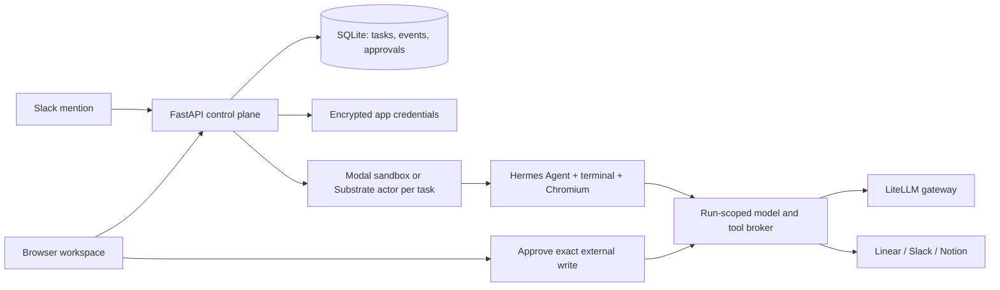
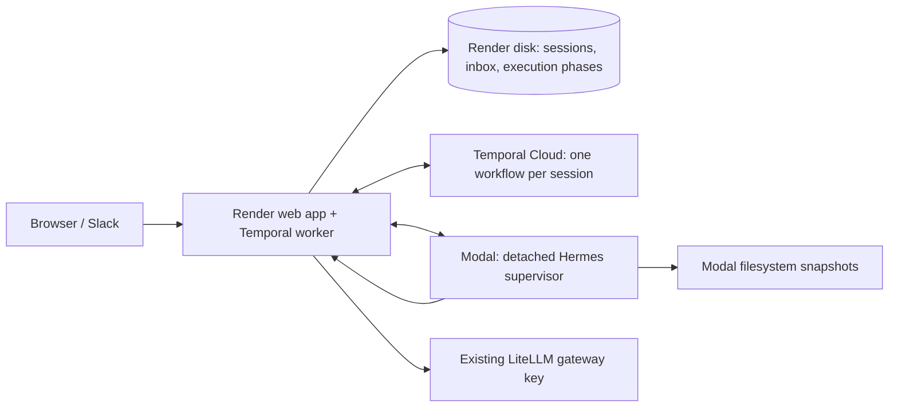

# Architecture and execution

[Documentation](README.md) · [Project overview](../README.md)

> This guide retains the detailed reference material from the original README.
> Dated acceptance reports describe past checks, not a current deployment or test result.

## What is implemented

| Area | Behavior |
| --- | --- |
| Chat sessions | Start a conversation, send follow-ups while work runs, revisit saved messages, see live tool progress, stop a response, and download the latest files. Follow-ups queue in order; duplicate sends do not run twice. |
| Cloud execution | Dedicated Modal sandbox (2 CPU / 4 GB) or Substrate actor (template-defined capacity) for each run; bounded concurrency; no app duration or iteration cap by default; automatic machine renewal; optional full VM runtime. The entire Hermes process runs inside the sandbox. |
| Hermes | Source pinned to commit `7968c72a3cb80beaae51948378944dd6e3423b96`; dependencies prepared through Hermes PM; terminal, file, and workspace MCP tools. |
| Model access | OpenAI Chat Completions through your LiteLLM-compatible gateway. The control plane pins the model, caps output and request count, and keeps the model key outside sandboxes. |
| Native connections | First-class Linear, Slack, Notion, and GitHub cards; OAuth when app clients are configured; validated personal/integration-token alternative; encrypted token storage and OAuth refresh. |
| Tool discovery | Codex uses native client `tool_search` and Claude uses native `ToolSearch` to load authorized MCP schemas, then calls discovered tools directly. Hermes keeps terminal/file tools direct and uses `tool_search`, `tool_describe`, and `tool_call`; its upfront catalog listing has a 600 estimated-token budget. |
| Organization controls | Shared connections, separate admin/member access, enabled/paused and read-only policies, health checks, and an audit history of connection changes. |
| Slack sessions | Mention @Moyai in a channel the bot has joined. Signed, deduplicated events start one saved session per thread. AgentChat routes mentions, thread follow-ups, and direct messages into saved conversations. Each top-level DM starts a new session; replies and native working status stay in its thread. |
| External writes | All enabled connected-app tools run directly, including new tools, GitHub PR creation/maintenance, Linear ticket creation/updates/comments, Slack messages and Notion writes. Read-only/paused policies still block writes. Ambiguous write failures are reported as uncertain and never retried automatically. |
| Agent browser | Isolated headless Chromium with open/read/click/fill tools over MCP; latest screenshot returned in the result archive. |
| Results | Summary, tracked changes as a patch, eligible new files, and latest browser screenshot. Up to 2 MB per artifact file / 15 MB collected content / 20 MB archive download. Hidden files and symlinks are skipped. |
| Saved workspace | Each response saves Hermes conversation history and a snapshot on its selected sandbox provider. With Temporal, follow-ups reuse the sandbox for five idle minutes; later responses restore saved files and tool history. Warm sandboxes consume compute. Filesystem snapshots do not preserve running background processes or browser tabs. |
| Restart handling | Saved chats and workspace snapshots survive deployments. Unfinished responses/queued messages are interrupted, capabilities revoked, and known sandboxes cleaned up. Send a new message to resume from the last saved workspace; unfinished external actions are never silently replayed. |

Linear, GitHub, Slack, and Notion tools are Moyai adapters exposed through the
workspace MCP server. Hermes discovers their authorized definitions locally at
startup, but the model sees a compact catalog and the search bridge instead of
every parameter schema. Browser, skills, credentials, and agent-coordination
tools use the same path. Search finds capabilities; describe returns selected
schemas; call invokes the existing tool. Repeated calls can reuse a schema
already in the conversation. Server-side permissions and revocation checks still apply to every invocation;
enabled tools run without a per-use approval step.

To verify this against the pinned Hermes runtime without model or provider
requests, set `HERMES_TEST_SOURCE` to its checkout and `HERMES_TEST_PYTHON` to
its Python interpreter (prepared with the `mcp` extra), then run
`python -m pytest -q -s tests/test_tool_discovery.py`. The test uses the real
stdio bridge and Moyai broker with fixture providers, checks the model-visible
schema size, and exercises scope restrictions, revocation, and denied writes.

## Architecture

The app uses native REST/GraphQL adapters for predictable OAuth and a small tool surface. A stdio MCP bridge exposes those tools to Hermes. A sandbox gets a random capability limited to its run and enabled apps; the capability is revoked on stop, completion, timeout, or restart. It does not receive model-provider or sandbox-provider account credentials. Agent code and browser sessions run in the selected sandbox provider, separately from the control-plane host.

Response states: `queued → provisioning → running → saving → idle` (shown as **Ready**). A session keeps its ID across responses. Messages submitted during a response queue for the next turn; they do not interrupt an in-flight tool. Each response receives a fresh sandbox capability, including on a reused machine. Model requests remain attributed to the original user and message across renewals. After saving the latest artifact and conversation/filesystem snapshot, a completed top-level Temporal chat keeps its sandbox for five idle minutes. Follow-ups reuse it; messages already queued drain before the idle timer starts. After release, the next response restores that snapshot. Snapshot retention is indefinite; Modal storage charges may apply. Stopping ends the current response and cancels queued messages. A new message resumes the last completed checkpoint; unfinished changes may be lost. Legacy tasks created before chat support remain readable with **Run again** available to start a new chat.

New requests and follow-ups to an idle session appear directly in the conversation as soon as the server accepts them, even before a worker claims them. Only messages waiting behind another input appear in the editable queue. The next dispatch candidate follows explicit Send now priority, automatic immediate follow-ups, then arrival order; durable queue and Temporal execution states stay unchanged. Starting a new request does not reopen the previous response's finished activity.

Public progress is limited to two distinct updates per response: a brief opening and, when useful, one meaningful milestone. For multi-step tasks, the agent is instructed to emit a visible sentence explaining its next steps before the first tool call, outside the opening status tag. A status-only heading is not an opening chat update. Before a planned delegation or handoff, the agent should explain the handoff using the milestone slot if it is still available. Later focus-only changes need no additional chat message. Quick tasks can go straight to the final answer. The server selects and saves updates once for both the web conversation and its connected Slack thread; extra narration is discarded. Restarting or renewing a sandbox does not reset this allowance. One direct reply to each delivered mid-task input can bypass the limit, while final answers, errors, approvals, credential requests, and structured tool activity keep their existing paths. Legacy non-chat runs receive the same two-update limit for the run.

During longer tasks, a short current-focus description replaces the web work heading and Slack's native thread status as the work changes. These descriptions are separate from the two posted updates and do not create chat messages. Tool details start collapsed on the web and remain available to expand. The agent supplies the description through its public interim callback; until one arrives, the normal lifecycle label is shown. Waiting, reconnecting, stopping, and completion take precedence. Focus is scoped to the current delivered input, survives reload/recovery, and rapid Slack changes coalesce over five seconds. Native statuses apply only to threaded Slack conversations, with the existing `assistant:write` permission.

Selected updates remain visible in the web conversation after tool history collapses, after completion, and on reload. Slack sends them through its existing outbox with replay protection, before the final answer. Unsent progress becomes obsolete when its response ends; adopting or waking a Slack thread does not backfill earlier updates. Unattempted progress survives worker recovery, while an uncertain send is never automatically retried. Existing historical web updates stay readable and are not backfilled to Slack.

This follows the [Codex active-turn steering contract](https://developers.openai.com/codex/app-server#steer-an-active-turn): append user input to the in-flight turn, then show subsequent public replies and progress in the same conversation. Moyai uses Hermes' runtime rather than Codex App Server, so tool interruption and streaming granularity can differ; public updates appear when Hermes emits its interim-message callback, not token by token.

**Send now** (or **Ctrl/Cmd+Enter**) delivers the selected queued message as guidance for the current task. Hermes' native redirect API cancels a pending model generation and continues the same agent loop with the correction; it preserves the original objective unless the user explicitly changes it. Supported foreground terminal commands yield into Hermes' background process registry and keep running; other tools finish safely before guidance is consumed. The web transcript keeps one work timeline and final answer, with corrections labeled **Steering**, and retains edits/deletes while an input is in the queue. By default, Enter during an active response queues a follow-up for the next turn. In **Settings → Personal preferences**, any signed-in member can opt into **Send messages immediately**. Enter and the send button then deliver web follow-ups through the same steering path, with each message appearing in the conversation while it is picked up. The preference is stored server-side for the authenticated user, persists across sign-ins/restarts, and applies across chats (including direct subagent chats). Google identities have independent preferences; shared password and local profiles share theirs. Consecutive immediate follow-ups retain their steering intent and are consumed in order, including messages arriving during another handoff. Existing queued messages stay queued, and disabling the setting affects future submissions. Requester/model changes still require the existing capability handoff. Slack has no Send now control, so thread replies sent during an active response are delivered as guidance automatically, one at a time in arrival order, whenever no other input is being sent; web-queued messages are unaffected.

Steering inputs have durable per-message receipts on Render. The native monitor checks every 200 ms plus request time instead of sleeping a full second between polls, and sends an immediate receipt after acceptance when the server advertises receipt-only support. Idle polling can reach five requests per second per active sandbox. Network reads and attachment preparation do not hold the model-generation lock; prepared input survives a rejected redirect and can be consumed at the next safe boundary. Closing prevents late delivery without waiting for a slow control read. Cross-requester/model changes are reclassified at a safe boundary and never globally interrupt tools from the background monitor. These changes reduce delivery overhead, not model response time; non-interruptible tools, network failures, attachments and checkpointed handoffs can still add delay. Existing sandboxes retain the old behavior until restarted.

Repeated polls cannot inject the same input twice in a live process; receipts also travel with the next model request and the final supervisor result so a lost acknowledgment during a worker restart is reconciled. Temporal reattaches to that supervisor, not a second agent process. A correction that loses the race with turn completion stays queued. Attachments are downloaded before delivery, and image previews enter model context only after delivery is acknowledged. New model requests retain the active task's requester/model and accounting identity. Switching requester or model uses the existing checkpointed handoff to change private skill/secret scope safely; a coordinator already released while waiting for children or a credential also resumes from its checkpoint. Failed or stopped execution retains its correction messages without automatically replaying uncertain actions.

Already-submitted inference can still finish and be billed by the gateway; Render records its eventual usage against the original message even if the sandbox disconnects. Superseded model replies/errors are discarded locally and unbilled admission retries stop. Native steering keeps the current sandbox/process, so periodic and end-of-turn checkpoints still provide durable workspace recovery without a full save/relaunch on every correction.

Temporary failures reading workspace tools, model discovery, or immutable attachments retry during startup. With Temporal, an exhausted tools/attachment retry becomes a durable **Reconnecting** wait (up to `STARTUP_RECOVERY_SECONDS`, default 600 seconds), then relaunches the same message/segment with a new supervisor attempt. This requires an explicit pre-execution marker, exit code 75, no execution-started event, and no change in the model-call counter. It preserves the original requester, model, attachments, checkpoint, and queued follow-ups. Stop cancels recovery. This is a startup recovery window, not a task time limit. Permanent access/configuration errors fail immediately; generic failures and uncertain in-flight model/tool writes are never automatically replayed. Non-Temporal mode receives the read retries but does not schedule a new startup attempt.

Final answers are stored on the control-plane disk and shown in browser chat as soon as Hermes returns them, before collecting artifacts or saving the Modal filesystem. The browser keeps showing workspace-saving activity; queued follow-ups still wait for that save. The early answer is replaced by the settled response, and Slack delivery remains tied to settlement. A save failure preserves the answer in web chat and Slack with an explicit warning, retains the previous snapshot, and cancels queued follow-ups. Restart recovery completes a received answer once without replaying work. A later explicit message receives the saved chat and a warning that its files may be older. The warning clears only after a successful snapshot. Recovery archives prioritize uncommitted patches and eligible new files in nested repositories over installed dependencies; they are bounded, incomplete backups and do not include newly committed history.

`RUN_TIMEOUT_SECONDS=0` and `MAX_AGENT_ITERATIONS=0` remove the app’s response-duration, tool-iteration, and model-request-count caps. Explicit nonzero values still enforce optional limits. `SNAPSHOT_TIMEOUT_SECONDS=180` separately allows three minutes for filesystem saving. Save failures now record the stage, exception type, elapsed time, configured timeout, and a redacted diagnostic reason. The original failure in session `43e5ab156ec94f31b1e8b61852be84f8` occurred after approximately 54 seconds of the old 55-second save window; Modal showed a terminated sandbox with a 15m32s lifetime and a 30m limit. The original exception details were discarded, so the exact cause is unconfirmed; the 30-minute execution limit was not reached.

Modal [limits each sandbox to 24 hours](https://modal.com/docs/guide/sandbox#timeouts). With no app time limit, `SANDBOX_ROTATION_SECONDS=82800` requests renewal after 23 hours at Hermes’s next step callback, between tool rounds. The remaining hour allows in-flight work and saving to finish. The conversation and filesystem must both be saved, all tool calls must have results, and the old machine must terminate before another machine continues the same user turn. Intermediate handoffs stay in session activity; Slack receives the final answer once. Stop, snapshot failure, incomplete tool history, and provider errors halt renewal. With the local execution engine, a server restart interrupts unfinished work without automatic replay. The optional Temporal engine below reconnects to its journaled executions. Snapshots preserve files, not live processes or browser tabs; an individual operation that cannot reach a safe boundary before Modal’s hard limit can still be interrupted.

**Live saving verification (September 30, 2026):** commit `eaf9ec5` deployed successfully to Render. A [#bot-spam mention and ordinary follow-up](https://berriaillm.slack.com/archives/C0B302ZJU05/p1790790095028019) used the same session (`6cda2f2a3e4e4523a4d973376e4b5b5f`). The first turn created a nested local git repository, left `note.txt` changed from `before` to `after`, and added untracked `extra.txt` containing `granite-save-62`. The downloaded archive contains the correct nested patch, new file, answer, and recovery manifest with no omissions. The second turn recalled the marker and re-read both files with their unchanged git status from a restored snapshot. Both answers appeared once in Slack with reaction acknowledgments. Existing sessions and all three organization connections remained present; health returned 200, unauthenticated session access returned 401, and Modal's API confirmed zero active sandboxes under `hermes-workspace`. See live screenshot (`../moyai-save-continuity-live.jpg`; historical artifact not included in this repository). Snapshot-failure, restart, queued-follow-up cancellation, and preserved-answer Slack delivery paths passed automated fault-injection tests; no failure was deliberately injected into production.

**Unlimited runtime verification (September 30, 2026):** commit `85a99c1` deployed successfully to Render with `RUN_TIMEOUT_SECONDS=0`, `MAX_AGENT_ITERATIONS=0`, and a 23-hour renewal threshold. The Runtime page displays **No app limit**. The suite passed 142 tests, including safe renewal, cancellation, save-failure, and request-attribution cases. A real Modal test using the pinned Hermes revision and a deterministic local model server used a shortened clock: one machine completed a terminal write, saved its conversation/filesystem, terminated, and a second machine restored the history and file without repeating the write. This verifies renewal mechanics, not 23-hour endurance.

A [live Slack test](https://berriaillm.slack.com/archives/C0B302ZJU05/p1790791584843379) queued an ordinary follow-up while a 45-second terminal operation was running. Both messages received one reaction and one answer in the same session (`91479b6674a64c27a587dd75bb34b19f`), with no periodic progress messages. The follow-up recalled `basalt-queue-73`, restored the saved file containing `23`, and changed/read it back as `24`. Modal confirmed zero active sandboxes afterward. Health returned 200 and unauthenticated configuration/session APIs returned 401. See runtime screenshot (`../moyai-unlimited-runtime-live.jpg`; historical artifact not included in this repository) and chat screenshot (`../moyai-queued-followup-live.jpg`; historical artifact not included in this repository).

With the user's approval, the historical answer from failed run `43e5ab156ec94f31b1e8b61852be84f8` was restored to its web transcript and [posted once by Moyai in the original thread](https://berriaillm.slack.com/archives/C04HP96S19D/p1790791554484499). The recovery explicitly describes the earlier execution, failing integration tests, lack of a PR, and unsaved latest files. The original error, prior snapshot, and an audit record were retained; the coding request was not replayed.

## Temporal session execution

**Enabled in production September 30, 2026.** Render uses the BerriAI Temporal
Cloud namespace in AWS Oregon (`us-west-2`), with 30-day
workflow-history retention and task queue `moyai-sessions-v1`. Its endpoint is
`<namespace>.tmprl.cloud:7233`. The worker service account has
account Read-Only and Write access to this namespace only. Its
`moyai-render-worker` API key expires **December 29, 2026**; rotate it before then
and update Render's private environment. Local `.env` keeps
`TEMPORAL_ENABLED=false` so development does not accidentally consume production
tasks. Use a distinct queue and isolated database for integration tests.

`TEMPORAL_ENABLED=true` wraps each chat in one long-lived `SessionWorkflow`.
Messages continue to be committed to Render's SQLite inbox before acknowledgment.
A durable wake outbox sends Signal-with-Start to `moyai-session-<session-id>`;
missed acknowledgments can safely be resent. The workflow drives bounded,
retryable Activities and waits for the next message when idle. It rolls its
history forward with Continue-As-New every 150 Activities, independently of
Modal machine renewal. Temporal history contains session IDs and small status
flags, not prompts, connection credentials, model responses, or workspace files.

The first deployment intentionally runs the Python Temporal worker **inside the
existing Render service**. Render services cannot share a persistent disk. Keep
one instance and one Uvicorn worker. Do not create a separate worker pointing at
a new SQLite database. Separating/scaling workers requires a shared database and
artifact storage migration. The Temporal service itself remains in Temporal Cloud.

Activities persist their phase before launching work. A stable Modal sandbox
name reconciles ambiguous creation; a detached supervisor uses an exclusive lock
and a durable started marker to prevent duplicate Hermes launches. On Render
restart the worker reconnects to the same machine and reads its result journal.
Worker shutdown leaves the sandbox alive and preserves its capability. A user
Stop instead immediately revokes that capability and durably requests cleanup.
Per-turn capabilities are derived from the unchanged encryption/session key and
are never sent to Temporal.

Every 10 minutes by default, Hermes pauses at the next safe tool-round boundary.
Its conversation and filesystem are snapshotted together before continuing on the
same machine. After 23 hours the old machine must be confirmed stopped before a
replacement restores the checkpoint and continues the same turn. Completed top-level
chats keep their machine for `SANDBOX_IDLE_SECONDS=300` after the queue drains;
set this to `0` for immediate release. The deadline is stored in SQLite and a
Temporal timer schedules cleanup without holding an Activity slot. Wakes and
worker restarts do not extend the deadline. If the worker is unavailable at
expiry, cleanup runs when it reconnects. Follow-ups within the window reuse the
machine with a fresh capability; after release, they restore the saved snapshot.
A missing idle machine is safely replaced before the new turn launches.
Finished child agents, coordinators waiting for children, stopped/failed turns
and failed saves release immediately. The local engine still releases each turn. Each final
answer is persisted before archive/snapshot operations. Three failed snapshot
attempts retain that answer with a warning, retain the prior snapshot, and stop
queued messages. Intermediate checkpoints are not posted as Slack answers.

Fresh-session adapters (Claude Agent SDK and the LiteLLM harnesses) save their
public working context in `/session/context.sqlite3`. This checkpoint contains
an append-only scrubbed journal, a bounded model-generated summary with an atomic
coverage cursor, and an independent pending-tool ledger. Resume reads the summary
and recent indexed previews; compaction consumes only new entries. Full receipts
remain available through bounded archive reads. The existing Modal snapshot saves
this database with the workspace; neither the transcript nor the summary enters
Temporal history. Temporal's `continue_as_new` bounds workflow history separately
from this model-context compaction. See [Agent harnesses](harnesses.md) for privacy,
migration, failure behavior and model-routing requirements.

**Durability limits:** Activities are at-least-once, not an exactly-once guarantee
for external effects. A missing machine or an abandoned launch marker with no
confirmed result stops with an explicit interruption rather than automatically
replaying potentially completed writes. The last safe checkpoint is retained for
an explicit follow-up. Snapshots do not contain RAM, running processes, or browser
tabs. A tool that cannot reach a safe boundary before Modal's hard limit can still
be interrupted. In-flight HTTP model/tool requests to the Render broker can fail
during a Render restart; Temporal does not transparently replay those requests.
Connection policies, uncertain-write handling, Slack outbox deduplication,
and per-user inference accounting remain in force. Modal snapshots are retained
indefinitely as before; periodic snapshots add storage usage and need an explicit
retention policy before large-scale use. Losing the Render disk still loses the
application data; Temporal history is not a database backup.

### Configure and roll out

1. Create a Temporal Cloud namespace in a nearby region. Create a service account
   limited to worker/client access for that namespace, not organization admin.
2. Privately set `TEMPORAL_ADDRESS` to the namespace's displayed endpoint,
   `TEMPORAL_NAMESPACE`, and `TEMPORAL_API_KEY` in Render. Keep
   `TEMPORAL_TLS=true`, `TEMPORAL_TASK_QUEUE=moyai-sessions-v1`, and
   `TEMPORAL_CHECKPOINT_SECONDS=600`. Never change `ENCRYPTION_KEY` or
   `SESSION_SECRET` during the migration.
3. Wait for existing legacy runs to finish or explicitly stop them. Back up the
   Render database. Then enable `TEMPORAL_ENABLED=true` and deploy. Startup
   refuses to adopt a legacy in-flight process without a recovery journal.
4. Runtime shows the selected engine and connection status. If Temporal is
   unreachable, new messages remain saved and queued. The worker retries the
   connection; it does not fall back to a second execution engine.
5. Verify a small session in `#bot-spam`, restart the Render worker while an
   operation is running, queue a follow-up, and confirm both responses and
   restored files. Confirm the workflow in Temporal and no idle Modal machines.

To roll back, drain Temporal work first; disabling it while execution phases are
active is rejected to protect unfinished work. Keep workflow and Activity names,
phase schema, and task queue compatible across code deployments. A breaking
change needs a versioned workflow/queue migration, not an in-place rename.

Local testing uses the official Temporal dev server through the Python SDK:
`uv run pytest tests/test_temporal_integration.py -q`. The first run downloads the
official CLI. That test stops a real Temporal worker during a simulated Modal
operation, queues a message while offline, starts a new worker on the same disk,
and verifies one execution per message and deterministic workflow replay.
`tests/test_durable.py` separately covers lost launch acknowledgments, checkpoint
renewal, cancellation, missing machines, save failure, and wake outbox races.

**Pre-deployment verification (September 30, 2026):** 154 tests pass. A real
Temporal dev server plus real Modal sandboxes and the pinned Hermes agent
survived a worker restart, processed a follow-up queued while offline, and
restored conversation/files across four sandboxes under shortened checkpoint and
renewal clocks. A deterministic local model fixture produced the file contents
`x`, `x`, `xy`, `xy`, confirming each terminal write happened once. Both answers
were recorded once; all test machines were terminated. This verifies the adapter
and recovery mechanics, not a 23-hour endurance run or the production cutover.

**Production recovery verified September 30, 2026:** commit `a39f68f` deployed to
Render with Temporal enabled after a private database backup and confirmation
that no legacy execution was active. A real
[#bot-spam conversation](https://berriaillm.slack.com/archives/C0B302ZJU05/p1790794436049919)
created this session (`6c4bad3e5a9e4b2c88c223bed07f2e24`).
Render was restarted during a 180-second terminal operation, with an ordinary
Slack follow-up already queued. The replacement worker reattached to the same
running Modal sandbox, completed the first response, and restored its snapshot
on another sandbox for the follow-up. Both answers and both reaction receipts
were sent once. The final downloaded archive contains exactly `first\nsecond\n`
in `new-files/temporal-restart-check.txt`, demonstrating neither append was
duplicated. The actual Cloud workflow history replayed successfully, recorded
the retried Activity, contains no test prompt or credentials, and is now waiting
for more messages with zero pending Activities. No Modal sandbox remained active.
All existing shared connections and BerriAI sign-in remained present;
unauthenticated configuration/session APIs returned 401 and health returned 200.

The restart also exposed a browser feed that could remain closed after a
deployment HTTP error. Commit `bb6fd9a` explicitly reconnects from the last event
cursor while preserving the composer; regression checks cover repeated failures,
duplicate events, navigating away, and stale callbacks. Run these checks with
`node --test tests/test_chat_stream.cjs`.
A second production restart with no active tasks verified that the updated web
chat showed "Reconnecting", recovered without a page reload, and preserved an
unsent draft. The Render Blueprint now also keeps `TEMPORAL_ENABLED=true`,
matching the verified production configuration.

## Parallel agents and demand-based capacity

**Live acceptance (September 30, 2026):** session ae775702 (`ae7757023de546dca13a68cc440fce37`) split 100 deterministic cases across five real Hermes/Modal workers, 20 cases each. All workers inherited the parent's marker file. Modal confirmed the first parent sandbox terminated while children worked; the coordinator resumed in a new sandbox, collected the five JSON artifacts, and validated 100 unique correct results (sum of squares 338,350). All five workers succeeded; all seven sandboxes used by the initial coordinator, five workers, and resumed coordinator terminated. Independent archive validation passed. All 34 model requests were priced, totaling $0.9373235, attributed once to the initiating Google user. This verifies real fanout/fanin and filesystem continuity, not a 100-container load test.

The same rollout moved 27 existing sessions, 13 user profiles, all three encrypted organization connections, and 25 result archives into **Organization for Litellm → Litellm** on Render. Google SSO and all three provider health checks passed on the new origin. Slack's verified event endpoint and Slack/Notion OAuth callback configuration use the new origin. The existing gateway key and spend ledger were preserved. A follow-up in the existing #bot-spam thread restored its prior marker and file value `24` and posted one answer with a link to the new origin.

`MAX_CONCURRENT_RUNS=100` is a workspace-wide ceiling on active and warm
sandboxes, including delegated workers. It does not pre-provision 100 machines.
Ten executing agents need about ten sandboxes, plus recent chats within their
five-minute idle window. Each completed response saves its filesystem immediately.
Idle sandboxes incur compute charges and are reclaimed oldest-first when another
session needs capacity; a sandbox with queued work is protected. Follow-ups reuse
a warm machine or restore a new sandbox from the snapshot after release. Provisioning/cleanup and Modal quotas
can temporarily change the observed count; capacity above the ceiling queues.
`MAX_PENDING_RUNS=1000` bounds the combined active/queued inbox. Modal CPU,
memory, concurrency and account quotas still apply; the app setting is not a
reservation of provider capacity. Each sandbox currently requests 2 CPU/4 GiB.

With Temporal enabled, any chat agent can use `agents_fanout` to supply either
explicit labeled assignments or common instructions plus an ordered list of
items. The server divides items into balanced contiguous partitions and assigns
each a stable one-based index. For example, 100 items with `workers=5` creates
five workers with exactly 20 cases each. Repeated launch calls with the same
`request_key` and original turn reuse the same group; changing its arguments
requires a new key. Each child inherits the initiating message's user, selected
model, repository and enabled app set, and receives an isolated snapshot of the
parent's current files. Finish file writes before delegating. Child conversations
start fresh; child changes are not automatically merged. Workers can delegate their assigned work to further agents with the same shared
queue and concurrency bounds. Each level keeps its direct parent and original workflow ancestry;
credentials still require the current requester and original session scope. Child agents follow the same policy: all enabled connected-app tools execute directly under the organization connection policies.

After the delegation tool completes, the coordinator checkpoints between tool
rounds, terminates its sandbox and waits durably. Its original user message stays
open. Once every child and its descendants have settled (including failures), it reacquires capacity,
restores its checkpoint and continues the same request with the worker reports.
This works even with only one available sandbox slot. Each child is an ordinary
Temporal `SessionWorkflow`; parent/group relationships and result data are stored
in SQLite rather than as large Temporal history payloads. A waiting parent uses
no Modal sandbox. It currently checks completion using a five-second Temporal
timer; this is a workflow-history cost, not sandbox idle time.

`agents_results` retrieves answers/statuses, and `agents_read_artifact` lists or
reads a bounded UTF-8 file from a child's recovery archive (128 KiB per read).
Workers should save structured case results under `/workspace`; the parent can
read and merge them into its own final result. Failure is not success or a zero
cost. `agents_retry` accepts explicit recovery instructions for failed workers;
it does not blindly replay uncertain external actions. Stopping a parent stops
its unfinished workers. The expandable sidebar nests each worker beneath its parent, with its own live status and direct chat. Individual activity and file downloads are available inside each worker session. The parent’s Activity panel shows combined progress and,
for admins, combined current-key model spend. Every request remains one ledger
row tied to the initiating teammate, so parent rollups do not double count
organization totals. Only the parent session mirrors its final answer to Slack.

The Render process still hosts one shared Temporal worker and SQLite disk.
`max_concurrent_activities` scales with the sandbox ceiling, but this does not
horizontally autoscale Render workers. Running multiple control-plane replicas
requires a shared database and artifact store first. Model response buffering is
separately bounded by `MAX_CONCURRENT_MODEL_REQUESTS=32` on the deployed 1 CPU /
2 GB Render instance (the local default remains 8); other agents can continue running sandbox commands while model calls
queue. The worker pool size and Modal sandbox count are separate concepts.
Queued model calls retry in the sandbox only after an explicit unbilled
admission response; each attempt refreshes its short-lived transport envelope.
Gateway errors and uncertain network failures are not retried by this queue.
Worker chats are inspectable, but instructions and retries go through the parent
so manual follow-ups cannot replace a worker's result while it is being gathered.

### Framework choice

Hermes remains the agent runtime. Its native delegation uses an in-process
thread pool; Moyai's added coordination handles independent Modal sessions,
durable waiting, capacity, identity and artifact collection. OpenAI's Agents SDK
supports manager-style agents-as-tools and beta Modal sandbox clients; CrewAI
supports hierarchical managers and checkpointing. Either is an alternative
runtime, but adopting one still requires the Moyai-specific persistence,
authorization and accounting contract. This feature does not stack these
frameworks or replace the existing Hermes conversation format.

Validation includes 100-slot admission (101st queues), disjoint 100/5 partitioning,
idempotent launch/retry, parent suspension with a one-slot limit, user attribution,
artifact access boundaries, cancellation, and a real Temporal dev-server worker
restart with five concurrently active simulated Modal workers. This is not a
100-sandbox production load test; verify provider quotas and control-plane memory
before sustained use at that scale.

### Direct subagent conversations

Click the chevron beside a parent session to expand its workers. Each child opens
its own saved chat, live activity, model picker and file download. Search matches
child labels while retaining their parent; direct links also keep older parents
visible beyond the recent-session limit. The large worker-card panel no longer
occupies the conversation. Drafts remain separate for each chat.

Authenticated web follow-ups can be sent directly to a child. They queue behind
its current turn and are charged to the signed-in sender. While the parent is
waiting, it waits for accepted follow-ups too, including messages arriving during
capacity admission. A parent stop blocks new child messages until cleanup finishes.
Workers still cannot create further agents, and organization connection policies
apply to their tool calls.

At handoff, the parent receives saved answers and immutable archive versions.
Later child chats can change their own workspace without silently changing those
collected results or launching another parent turn. `agents_results` and
`agents_read_artifact` default to the handoff version; the parent can explicitly
request `latest=true` when asked to inspect subsequent work. Existing completed
groups are preserved before their first direct follow-up. Archives are published
by atomic replacement; retained hard links initially share storage, with later
changed versions consuming additional disk space. Runtime and spend views show
the workers’ current state and all attributed follow-up costs.
