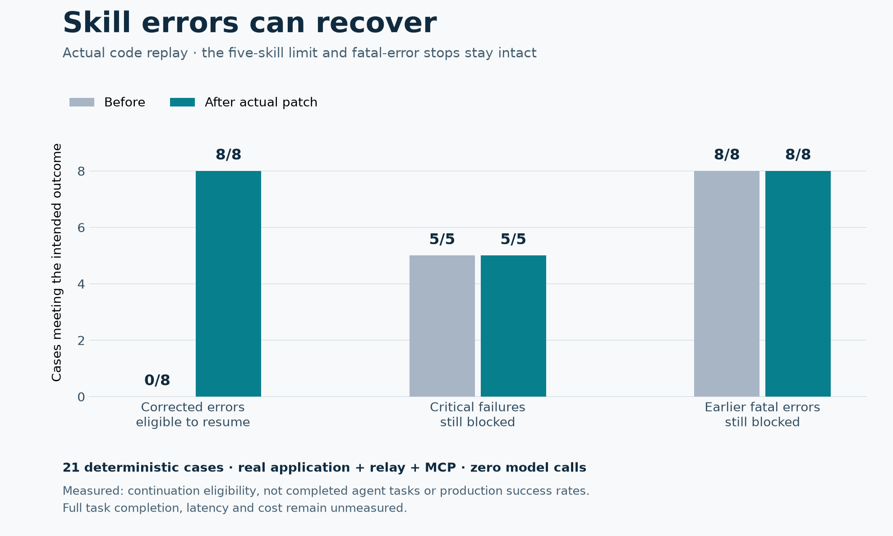

# Skill errors can recover without losing the safety stop

This is the **historical paired benchmark** of baseline `33900218` and candidate `f39dc2bc`, recorded on October 9, 2026. PR #308 subsequently shipped the recovery behavior and removed the five-skill cap. The chart and raw results below remain the original measurements; they do not describe the new unlimited-skill policy. This PR now adds regression coverage for the seven rejection classes that still exist (19 checks including fatal-state controls), without changing application behavior.

Current-main validation (`66e61fdb`): 354 tests passed across skill recovery, skills, skill saving, broker transport, MCP, spend accounting, and the harness gateway on Python 3.13. This includes the corrected preserved-429 assertion from PR #314. Python compilation and `git diff --check` passed. The current tests deliberately do not reintroduce the removed cap.

A production skill-sync run spent **11.8 minutes** on 33 model calls and 180 tool calls, then ended with “Use at most five skills in one turn.” It later issued a successful delegation, but the earlier rejection left a fatal relay error that prevented continuation. This fix keeps the limit and makes definite skill rejections actionable tool receipts.



| Measured boundary | Before | After |
| --- | ---: | ---: |
| Corrected skill errors eligible to resume | 0 / 8 | **8 / 8** |
| Critical errors still block recovery | 5 / 5 | **5 / 5** |
| Earlier fatal errors remain blocked after correction | 8 / 8 | **8 / 8** |

The eight cases cover the load limit, unavailable skill, stale search turn, empty search keywords, unauthorized organization save, stale save revision, missing supporting file, and out-of-range file offset. The five-skill limit stays enforced; unauthorized organization writes remain denied, rejected writes are not retried, and unrequested supporting-file contents stay out of these error responses. Rejection messages now reach the MCP caller with enough detail to correct the request.

**Confidence and impact.** High confidence that the reproduced transport failure is fixed: the same frozen cases ran through the actual application, encrypted relay, and MCP bridge against both versions. These are targeted regression cases, not a sample of production success rates. We measured **continuation eligibility**, not completed agent tasks. Full skill-sync completion, latency, tokens, and cost remain unmeasured. No model calls or production writes were needed for this benchmark.

**Validation:** 420 tests passed; one Linux-only memfd credential-file test was skipped on macOS. The checked suites cover skills, memory/privacy, credentials, broker transport, MCP, and tool replay classifications. After rebasing onto the latest main, the replay and new admission tests passed 45 / 45. Python compilation and `git diff --check` also passed. Docker/Kubernetes lifecycle jobs and live model evaluations were not run locally.

**Evidence:** production trace `79ae353201fd710fd330e4168097c03e`; baseline commit `33900218b4d7c7dca6824fbeb55e16779c5137bb`; candidate `app/main.py` Git blob `3f10c66536afee06141084d105abaf7323962c75`; frozen test Git blob `dc50061ddeb46f1625861b0a09ddb2aac9413b91`. The production trace motivates the test but is not itself replayed. The candidate changes only the skill-tool exception envelope. Raw paired measurements are in [skill-rejection-replay.json](skill-rejection-replay.json).

To reproduce the historical comparison with Python 3.13 and the repository dependencies, use the frozen candidate checkout below. The baseline receives the identical historical test file; its 16 failures are expected because it lacks the corrected receipt/recovery behavior. Both historical versions should retain all 13 fatal-state protections.

```sh
git worktree add --detach /tmp/moyai-skill-base 33900218b4d7c7dca6824fbeb55e16779c5137bb
git worktree add --detach /tmp/moyai-skill-candidate f39dc2bc02c925de7c1ac2147fd9d864f0d83f64
cd /tmp/moyai-skill-candidate
cp tests/test_skill_recovery.py /tmp/moyai-skill-base/tests/test_skill_recovery.py
python -m pytest tests/test_skill_recovery.py -q -o junit_family=xunit1 --junitxml=/tmp/skill-after.xml
cd /tmp/moyai-skill-base
python -m pytest tests/test_skill_recovery.py -q -o junit_family=xunit1 --junitxml=/tmp/skill-before.xml
```

The `replay` property in each JUnit case contains the observed tool errors, corrected receipts, relay failure state, call count, and loaded-skill count. The candidate should pass 21 / 21 cases. The test fixture checks the same relay failure flag used by the runtime's continuation gate; it does not simulate a model choosing to recover.
