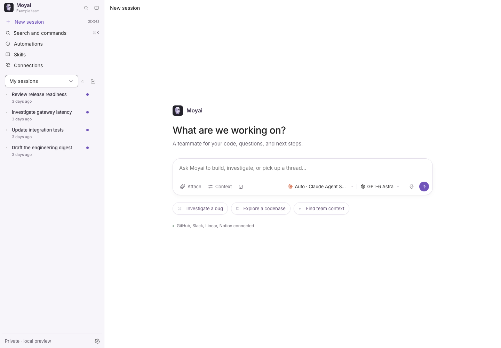
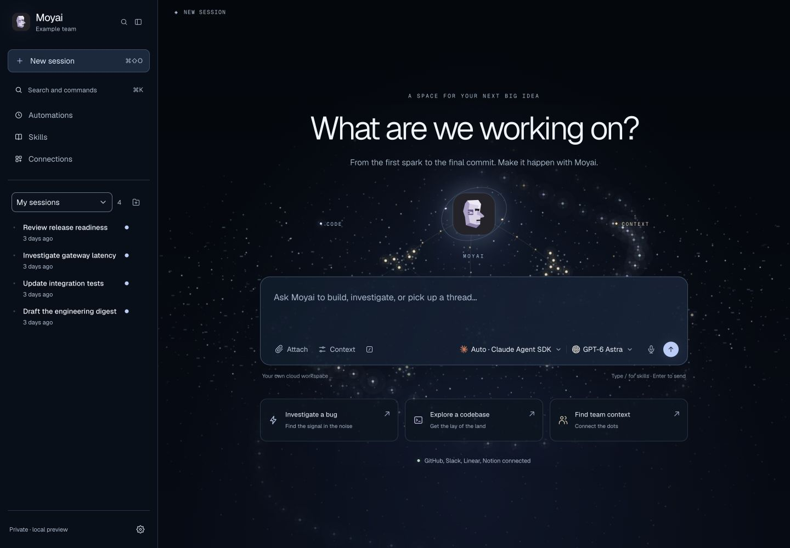
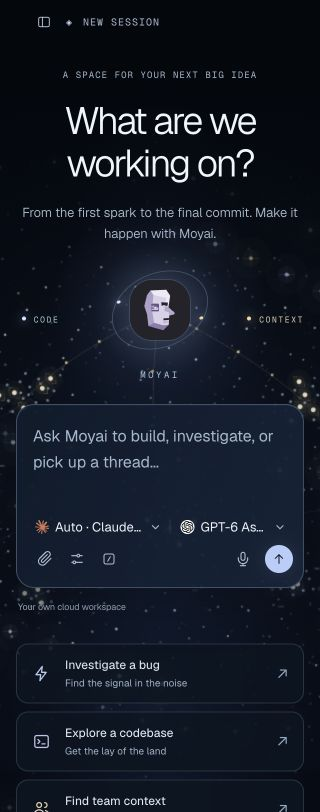
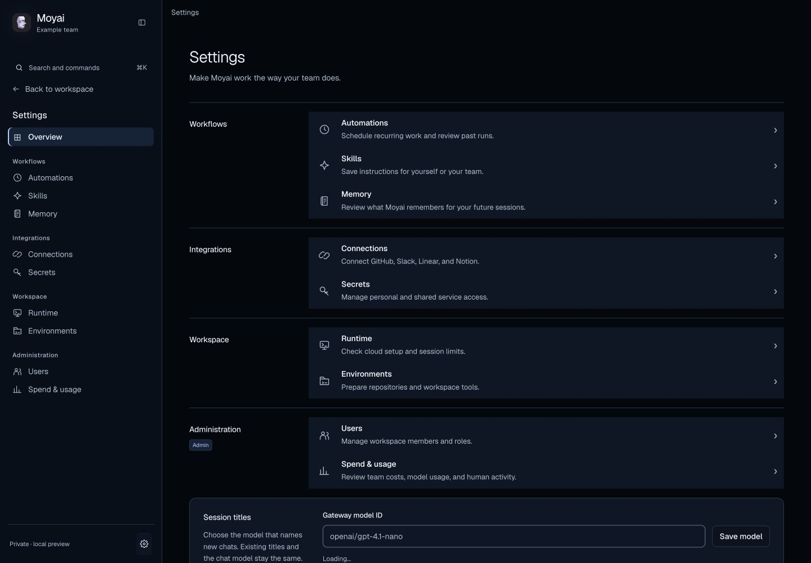

# Moyai deep-space workspace

The workspace uses the approved Lens constellation direction: near-black navy,
icy Geist typography, restrained gold worker clusters, packet streams, and a
Moyai hub. The home canvas adapts the deterministic `AgentSwarmField` and
`DeepSpaceBackdrop` artwork from the Lens launch skill. Particle counts and
worker activity are decorative, not production metrics. No historical Lens user
messages, trace evidence, or customer captures are included.

Geist and Geist Mono are served locally under `app/static/fonts`, with their SIL
Open Font License. There are no new dependencies or external font requests.
Shared color roles cover the workspace, conversations, settings, menus, and
portalled dialogs. The existing controller, API, form, and permission contracts
remain in place.

## Local preview

```sh
npm ci
npm run build
npm run preview -- --port 8840
```

Open `http://127.0.0.1:8840/#tasks` for populated synthetic UI fixtures. This
preview cannot call models or connected services.

To try session creation and replies with the real local APIs and demo executor:

```sh
uv run python scripts/session_ui_demo.py --port 8830
```

Open `http://127.0.0.1:8830/demo/login`. Responses are simulated; cloud agents,
production authentication, and connected-provider operations are not exercised.

## Motion and accessibility

The canvas follows the rendered hub through resizing and late font loading,
caps its backing scale at 2×, and paints at no more than 30 frames per second.
It pauses in hidden tabs, renders a static frame for reduced motion, and releases
animation/listeners when leaving the home screen. It is hidden from assistive
technology and cannot intercept clicks. Functional focus outlines and semantic
success, warning, and error colors remain visible on dark surfaces.

## Screenshots

Before and after show the real frontend at 1440 × 1000 with the same synthetic
preview data. The mobile image uses a 320 × 812 viewport; the page scrolls
vertically to the remaining actions.

| Before | After |
| --- | --- |
|  |  |





## Verification

Run the repository's frontend checks:

```sh
npm run typecheck
npm run build
npm test
npm run test:ui
```

Generated `app/static/ui` assets are checked in with their sources. The existing
browser suite covers desktop/tablet/mobile navigation, dialogs, dropdowns,
keyboard paths, and populated/empty/error/member fixtures. New canvas tests cover
motion preferences, hidden tabs, cleanup, and hub alignment. The local demo was
also exercised through creating a session and displaying its saved response.
Screen-reader output, non-Chromium browsers, production SSO, and real model or
provider operations were not tested in this visual change.
