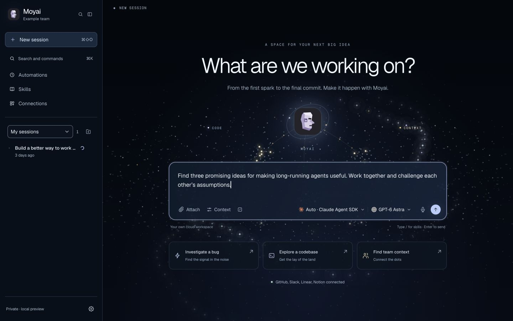
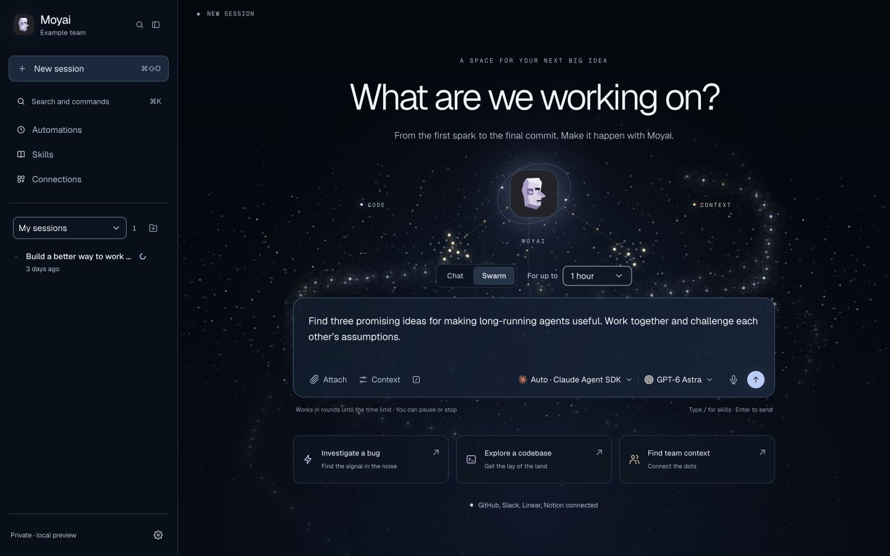
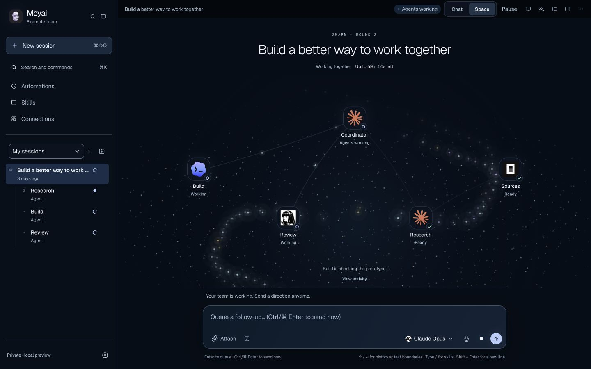

# Swarm mode

Choose **Swarm**, describe a task, and set a maximum duration. Moyai immediately queues 10 real child agents with complementary perspectives, then the coordinator gathers their outputs into a useful result. Harnesses are assigned in a randomized, balanced rotation across the configured runtime/model pairs. Each worker receives the complete original task, initial uploads, enabled apps, and the existing permission rules. The activity view shows actual launches, handoffs, tools, and messages; queued workers are not presented as running before they acquire capacity.

Swarm mode requires the existing cloud sandbox setup and Temporal execution. It uses Moyai's durable sessions, saved conversation/workspace checkpoints, delegation tools, and permission boundaries. It is not an independent background loop or a Hermes `/goal` command.

The swarm belongs to its coordinator agent. Shared planning, prompts and the typed Python interface live in [`agent/swarm`](../agent/swarm/README.md); the app supplies persistence, scheduling and visualization. Python integrations and model-facing delegation tools use the same request contracts and durable coordinator.

Set `MAX_PARALLEL_AGENTS` to at least 10. `MAX_CONCURRENT_RUNS` and `MAX_CONCURRENT_MODEL_REQUESTS` still bound actual execution; a smaller capacity queues the rest of the team. Set `SWARM_MODELS` to a comma-separated list of enabled models allowed for automatic worker selection (for example `anthropic/claude-opus-5-5,openai/gpt-6.1-sol`). When unset, workers inherit the selected coordinator model. Claude Agent SDK and Codex prefer their native provider when that provider is in the list. Model choices must still pass the workspace's normal validation. This is diverse assignment, not a quality-routing claim. The initial team is pinned on creation and is never rerolled by HTTP retries or a worker restart.

The coordinator waits without a sandbox while the initial team works, then receives their actual saved answers and can read their artifacts. Follow-up rounds can request additional focused work without creating another automatic 10-agent team. Initial uploads use independent, authorized attachment records; these copies count against the workspace attachment-storage limit. Creation rejects the entire mission if worker admission, model selection, or upload capacity fails.

After a confirmed, checkpointed answer, the host waits 30 seconds using a durable timer, then schedules another round while budget remains. Automatically generated messages are marked as swarm continuations. A human message takes priority over a continuation that has not started. Agent context retains the original task, prior results, and human directions.

The duration is a wall-clock deadline from creation, including queuing, sandbox preparation, delegated work, and pauses. Refreshing the page or replacing a worker does not reset it. The deadline also applies to descendants; the host cancels unfinished work when it expires. There is a 25-round maximum and a guard against repeatedly returning an identical answer.

**Pause** cancels current execution and preserves saved work. **Resume** is explicit and only available after cleanup while time remains; it keeps the original deadline. **Stop** permanently ends this mission and cascades to delegated agents. Start a new mission for a new time budget. Failed, interrupted, or uncertain execution blocks automatic continuation; review saved results and verify uncertain external actions before explicitly resuming. Normal app approvals still apply.

The API accepts `swarm: {"budget_seconds": 300}` on `POST /api/runs` (60–86,400 seconds). Run details include `swarm.status`, `budget_seconds`, `ends_at`, `round`, and `reason`. Controls are `POST /api/runs/{id}/swarm/pause`, `POST /api/runs/{id}/swarm/resume`, and the existing `POST /api/runs/{id}/cancel`. They require normal authentication and mutation protection. Creation, mission intent, the initial message, all 10 workers, their group, and all durable dispatch wakes commit atomically; continuation messages, round advancement, and their dispatch wake do likewise.

Schema revision 5 adds `swarm_missions` and pinned per-worker runtime assignments. For deployments using explicit PostgreSQL migrations, stop runtime owners and run the existing offline migration before starting this version. This feature does not deploy or migrate an existing production installation automatically.

## Interface preview

These are actual browser captures of the production frontend against synthetic local fixtures. They demonstrate the interface, not live model execution. The creation comparison uses the same sample data and a 1440 × 900 viewport.

| Before | Swarm mode |
| --- | --- |
|  |  |

[Mobile view at 320px](assets/swarm-mode-mobile.jpg). The interface was also checked at 768px, including draft preservation between Chat and Space, child conversations and model identity, duration selection, Pause/Resume/Stop, keyboard focus, and blocked/expired message controls. Reduced-motion behavior is covered by the canvas implementation; a screen-reader audit was not performed.

To inspect the same sample locally, run `npm run preview -- --port 8840` and open `http://127.0.0.1:8840/?fixture=swarm#run=aaaaaaaaaaaaaaaaaaaaaaaaaaaaaaaa`. Alternate fixtures are `swarm-paused`, `swarm-expired`, and `swarm-error`.
